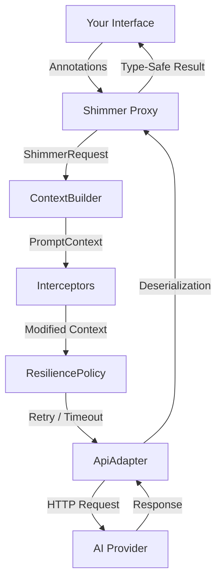

# Shimmer


A **Retrofit-style interface abstraction for AI APIs** in Kotlin. Define an interface with annotations, and Shimmer generates a type-safe client backed by a dynamic proxy — just like Retrofit does for REST.

```kotlin
interface QuestionAPI {
    @AiOperation(description = "Provide an in-depth answer to the question")
    suspend fun askQuestion(
        @AiParameter(description = "The question to be answered")
        question: String
    ): String
}

val instance = shimmer<QuestionAPI> {
    adapter(OpenAiAdapter())
}

val answer = instance.api.askQuestion("What is the meaning of life?")
```

## Features

- **Interface-driven** — define AI interactions as Kotlin interfaces
- **Kotlin DSL** — configure with `shimmer<T> { ... }` builder DSL
- **Coroutine support** — `suspend` functions work natively alongside `Future<T>`
- **Streaming** — return `Flow<String>` for token-by-token streaming responses
- **Annotation metadata** — describe operations, parameters, and response schemas for the AI
- **Adapter pattern** — swap AI providers without changing your interface (OpenAI included)
- **Multi-vendor routing** — route requests to different adapters per method (e.g., Anthropic for text, OpenAI for images)
- **Tool calling** — multi-turn LLM↔tool loops with pluggable `ToolProvider` abstraction
- **MCP support** — consume MCP server tools and expose Shimmer interfaces as MCP servers
- **Context control** — replace or intercept the prompt pipeline with `ContextBuilder` and `Interceptor`
- **Conversation history** — inject prior messages via `PromptContext.conversationHistory` for multi-turn conversations
- **Resilience** — retry with exponential backoff, per-call timeouts, result validation, and fallback adapters
- **Memory system** — persist results across calls with `@Memorize` for stateful conversations
- **Type-safe responses** — get deserialized Kotlin objects back, not raw strings
- **Agent patterns** — build multi-step and decision-making AI workflows with `shimmer-agents`
- **Test-first** — `shimmer-test` module with `MockAdapter`, `MockToolProvider`, test helpers, and prompt assertions

## Project Structure

Shimmer is organized into a core library, vendor adapters, extensions, and samples. See the individual READMEs for deep dives into specific features.

| Module | Description |
|--------|-------------|
| [`shimmer-core`](shimmer-java/core/README.md) | Core library — annotations, proxy, context pipeline, routing adapter, tool-calling abstractions, resilience. Zero AI-provider dependencies. |
| [`shimmer-openai`](shimmer-java/vendor/openai/README.md) | OpenAI adapter — sends `PromptContext` to OpenAI with native tool-calling support. |
| [`shimmer-gemini`](shimmer-java/vendor/gemini/README.md) | Google Gemini adapter — sends `PromptContext` to Gemini with native tool-calling support. |
| [`shimmer-claude`](shimmer-java/vendor/claude/README.md) | Anthropic Claude adapter — sends `PromptContext` to Claude with native tool-calling support. |
| [`shimmer-mcp`](shimmer-java/ext/mcp/README.md) | MCP integration — consume MCP server tools via `McpToolProvider`, expose Shimmer interfaces as MCP servers via `ShimmerMcpServer`. |
| [`shimmer-agents`](shimmer-java/ext/agents/README.md) | Agent abstractions — `AutonomousAgent`, `DecidingAgent`, `AgentDispatcher` for multi-step AI workflows. |
| [`shimmer-test`](shimmer-java/ext/test/README.md) | Test utilities — `MockAdapter`, `MockToolProvider`, prompt assertions, test fixtures, `shimmerTest<T>()` / `shimmerStub<T>()` helpers. |
| [`shimmer-debug`](shimmer-java/ext/debug/README.md) | Debug adapter — wraps any adapter and writes request/response markdown files for post-hoc inspection. |
| [`samples-dnd`](shimmer-java/samples/dnd/README.md) | Sample app — a text-based D&D adventure with the AI as Dungeon Master. |

## Installation

Clone and build from source:

```bash
git clone https://github.com/adamhammer/Shimmer.git
cd Shimmer/shimmer-java
./gradlew build
```

Then add the modules as dependencies in your project:

```groovy
dependencies {
    implementation project(':shimmer-core')
    implementation project(':shimmer-openai')   // or your own adapter
    implementation project(':shimmer-agents')   // optional: agent patterns
    testImplementation project(':shimmer-test')  // test utilities
}
```

All library modules include `maven-publish` configuration for local or remote publishing.

## Quick Start

### 1. Define your API interface

Methods can return `Future<T>` or use `suspend`:

```kotlin
interface QuestionAPI {
    @AiOperation(description = "Answer the question in depth")
    @AiResponse(description = "The answer", responseClass = Answer::class)
    suspend fun askStruct(
        @AiParameter(description = "The question and its context")
        question: Question
    ): Answer

    @AiOperation(description = "Answer the question as plain text")
    @Memorize("last-answer")
    fun askString(
        @AiParameter(description = "The question")
        question: String
    ): Future<String>
}
```

### 2. Define your data classes

```kotlin
@Serializable
@AiSchema(description = "Holds info about the question")
data class Question(
    @AiSchema(description = "The question to be asked")
    val question: String = "",
    @AiSchema(description = "Who is asking the question")
    val context: String = ""
)

@Serializable
@AiSchema(description = "Holds the answer to the question")
data class Answer(
    @AiSchema(description = "A deep answer to the question")
    val answer: String = ""
)
```

### 3. Build and use

```kotlin
// DSL style (recommended)
val instance = shimmer<QuestionAPI> {
    adapter(OpenAiAdapter())
    resilience {
        maxRetries = 2
        timeoutMs = 30_000
    }
}

val answer = instance.api.askStruct(Question("What is the meaning of life?", "A curious student"))

// Builder style (also supported)
val instance2 = ShimmerBuilder(QuestionAPI::class)
    .setAdapterDirect(OpenAiAdapter())
    .build()
```

## Architecture



1. You define an interface with methods representing AI operations
2. Annotations provide metadata about operations, parameters, and expected response schemas
3. `shimmer<T> { ... }` (or `ShimmerBuilder`) creates a JDK dynamic proxy implementing your interface
4. The proxy builds a `ShimmerRequest` and passes it to a `ContextBuilder`
5. The `ContextBuilder` assembles a `PromptContext` (system instructions + method invocation JSON)
6. `Interceptor`s modify the context in registration order (inject world state, filter memory, etc.)
7. The `ResiliencePolicy` handles retries, timeouts, validation, and fallback
8. The `ApiAdapter` sends the final context to the AI provider
9. Responses are deserialized into your specified types via `kotlinx.serialization`

## Case Study: Text D&D (`samples-dnd`)

The `samples-dnd` module is a complete text-based Dungeons & Dragons adventure demonstrating Shimmer's advanced AI patterns. It uses the AI as both the Dungeon Master (DM) and the Player Characters (PCs), showcasing how to build complex, multi-agent, stateful AI applications.

**[Read the full D&D Case Study](shimmer-java/samples/dnd/README.md)** to learn how it uses:
- **Shimmer Agents** (`AutonomousAgent`) to simulate independent player decision-making.
- **Interceptors** (`WorldStateInterceptor`) to dynamically inject real-time game state into the AI's system instructions.
- **ResiliencePolicy** to enforce business logic on the AI's structured outputs (e.g., validating HP changes).
- **Memory** (`@Memorize`) to automatically persist the AI's intermediate thoughts across its multi-step turn.
- **Tool Calling** to give agents access to deterministic game data (e.g., inspecting inventory and skills).

## License

MIT — see [LICENSE](LICENSE) for details.
