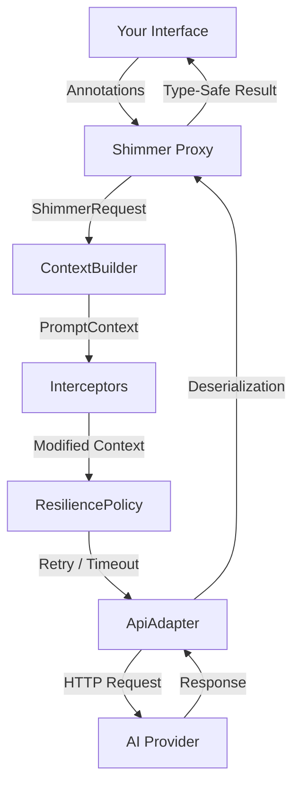

# Shimmer


A **Retrofit-style interface abstraction for AI APIs** in Kotlin. Define an interface with annotations, and Shimmer generates a type-safe client backed by a dynamic proxy — just like Retrofit does for REST.

```kotlin
interface QuestionAPI {
    @AiOperation(description = "Provide an in-depth answer to the question")
    suspend fun askQuestion(
        @AiParameter(description = "The question to be answered")
        question: String
    ): String
}

val instance = shimmer<QuestionAPI> {
    adapter(OpenAiAdapter())
}

val answer = instance.api.askQuestion("What is the meaning of life?")
```

## Features

- **Interface-driven** — define AI interactions as Kotlin interfaces
- **Kotlin DSL** — configure with `shimmer<T> { ... }` builder DSL
- **Coroutine support** — `suspend` functions work natively alongside `Future<T>`
- **Annotation metadata** — describe operations, parameters, and response schemas for the AI
- **Adapter pattern** — swap AI providers without changing your interface (OpenAI included)
- **Tool calling** — multi-turn LLM↔tool loops with pluggable `ToolProvider` abstraction
- **MCP support** — consume MCP server tools and expose Shimmer interfaces as MCP servers
- **Context control** — replace or intercept the prompt pipeline with `ContextBuilder` and `Interceptor`
- **Resilience** — retry with exponential backoff, per-call timeouts, result validation, and fallback adapters
- **Memory system** — persist results across calls with `@Memorize` for stateful conversations
- **Type-safe responses** — get deserialized Kotlin objects back, not raw strings
- **Agent patterns** — build multi-step and decision-making AI workflows
- **Test-first** — `shimmer-test` module with `MockAdapter`, `MockToolProvider`, test helpers, and prompt assertions

## Project Structure

| Module | Description |
|--------|-------------|
| `shimmer-core` | Core library — annotations, proxy, context pipeline, tool-calling abstractions, resilience. Zero AI-provider dependencies. |
| `shimmer-openai` | OpenAI adapter — sends `PromptContext` to OpenAI with native tool-calling support. |
| `shimmer-mcp` | MCP integration — consume MCP server tools via `McpToolProvider`, expose Shimmer interfaces as MCP servers via `ShimmerMcpServer`. |
| `shimmer-test` | Test utilities — `MockAdapter`, `MockToolProvider`, prompt assertions, test fixtures, `shimmerTest<T>()` / `shimmerStub<T>()` helpers. |
| `samples-dnd` | Sample app — a text-based D&D adventure with the AI as Dungeon Master. |

## Installation

Clone and build from source:

```bash
git clone https://github.com/adamhammer/Shimmer.git
cd Shimmer
./gradlew build
```

Then add the modules as dependencies in your project:

```groovy
dependencies {
    implementation project(':shimmer-core')
    implementation project(':shimmer-openai')   // or your own adapter
    testImplementation project(':shimmer-test')  // test utilities
}
```

All library modules include `maven-publish` configuration for local or remote publishing.

## Quick Start

### 1. Define your API interface

Methods can return `Future<T>` or use `suspend`:

```kotlin
interface QuestionAPI {
    @AiOperation(description = "Answer the question in depth")
    @AiResponse(description = "The answer", responseClass = Answer::class)
    suspend fun askStruct(
        @AiParameter(description = "The question and its context")
        question: Question
    ): Answer

    @AiOperation(description = "Answer the question as plain text")
    @Memorize("last-answer")
    fun askString(
        @AiParameter(description = "The question")
        question: String
    ): Future<String>
}
```

### 2. Define your data classes

```kotlin
@Serializable
@AiSchema(description = "Holds info about the question")
data class Question(
    @AiSchema(description = "The question to be asked")
    val question: String = "",
    @AiSchema(description = "Who is asking the question")
    val context: String = ""
)

@Serializable
@AiSchema(description = "Holds the answer to the question")
data class Answer(
    @AiSchema(description = "A deep answer to the question")
    val answer: String = ""
)
```

### 3. Build and use

```kotlin
// DSL style (recommended)
val instance = shimmer<QuestionAPI> {
    adapter(OpenAiAdapter())
    resilience {
        maxRetries = 2
        timeoutMs = 30_000
    }
}

val answer = instance.api.askStruct(Question("What is the meaning of life?", "A curious student"))

// Builder style (also supported)
val instance2 = ShimmerBuilder(QuestionAPI::class)
    .setAdapterDirect(OpenAiAdapter())
    .build()
```

## Architecture



1. You define an interface with methods representing AI operations
2. Annotations provide metadata about operations, parameters, and expected response schemas
3. `shimmer<T> { ... }` (or `ShimmerBuilder`) creates a JDK dynamic proxy implementing your interface
4. The proxy builds a `ShimmerRequest` and passes it to a `ContextBuilder`
5. The `ContextBuilder` assembles a `PromptContext` (system instructions + method invocation JSON)
6. `Interceptor`s modify the context in registration order (inject world state, filter memory, etc.)
7. The `ResiliencePolicy` handles retries, timeouts, validation, and fallback
8. The `ApiAdapter` sends the final context to the AI provider
9. Responses are deserialized into your specified types via `kotlinx.serialization`

### Context Pipeline

The `ContextBuilder` and `Interceptor` interfaces give you full control over how prompts are constructed:

```kotlin
val instance = shimmer<MyAPI> {
    adapter(OpenAiAdapter())
    contextBuilder(myCustomContextBuilder)
    interceptor { ctx ->
        ctx.copy(systemInstructions = ctx.systemInstructions + "\nBe concise.")
    }
    interceptor { ctx ->
        ctx.copy(properties = ctx.properties + ("world" to worldState))
    }
}
```

### Resilience

Configure retry, timeout, validation, and fallback behavior:

```kotlin
val instance = shimmer<MyAPI> {
    adapter(primaryAdapter)
    resilience {
        maxRetries = 3
        retryDelayMs = 1000
        backoffMultiplier = 2.0
        timeoutMs = 30_000
        resultValidator = { result ->
            (result as? MyResult)?.isValid == true
        }
        fallbackAdapter = StubAdapter()
    }
}
```

### Memory

Methods annotated with `@Memorize` store their results (as JSON) in a shared memory map, which is passed to subsequent requests:

```kotlin
@Memorize("user-input")
fun storeInput(input: String): Future<String>

// Subsequent calls receive the stored memory automatically
fun retrieveWithContext(): Future<String>
```

Read memory state via `instance.memory` (read-only map).

### Coroutines

Shimmer supports both `Future<T>` and `suspend` functions:

```kotlin
interface MyAPI {
    // Future-based
    fun getData(): Future<Result>

    // Coroutine-based
    suspend fun getDataAsync(): Result
}
```

Suspend functions are automatically detected and executed on `Dispatchers.IO`.

## Testing

The `shimmer-test` module provides everything you need for offline testing:

### MockAdapter

```kotlin
// Scripted responses
val mock = MockAdapter.scripted(result1, result2)
val (api, mock) = shimmerTest<MyAPI>(mock)
api.get().get()
mock.verifyCallCount(1)
mock.lastContext!!.assertSystemInstructionsContain("specialized AI")

// Dynamic responses
val mock = MockAdapter.dynamic { context, resultClass ->
    if (resultClass == String::class) "dynamic" else MyResult("computed")
}

// Builder for complex scenarios
val mock = MockAdapter.builder()
    .responses(result1, result2)
    .delayMs(500)           // simulate latency
    .failOnCall(0)          // throw on first call
    .build()
```

### Test Helpers

```kotlin
// Quick setup with MockAdapter
val (api, mock) = shimmerTest<MyAPI>(MockAdapter.scripted(result))

// Quick setup with StubAdapter (returns defaults)
val api = shimmerStub<MyAPI>()
```

### Prompt Assertions

```kotlin
mock.lastContext!!
    .assertSystemInstructionsContain("specialized AI")
    .assertMethodInvocationContains("greet")
    .assertMemoryContains("key", "value")
    .assertMemoryEmpty()
    .assertPropertyEquals("key", expectedValue)
    .assertHasTools("calculator", "search")
    .assertToolCount(2)
```

### MockToolProvider

```kotlin
val mockTools = MockToolProvider.builder()
    .tool("calculator", "Performs math", """{"type":"object","properties":{"expr":{"type":"string"}},"required":["expr"]}""")
    .handler("calculator") { call -> ToolResult(call.id, call.toolName, "42") }
    .build()

val instance = shimmer<MyAPI> {
    adapter(mock)
    toolProvider(mockTools)
}

// After calls:
mockTools.verifyCallCount(1)
mockTools.lastCall  // most recent ToolCall
```

### Live Test Isolation

Tests that call the real OpenAI API are tagged with `@Tag("live")` and excluded by default:

```bash
# Run only offline tests (default)
./gradlew test

# Include live tests (requires OPENAI_API_KEY)
./gradlew test -PliveTests
```

## Sample: Text D&D (`samples-dnd`)

A complete text-based D&D adventure demonstrating Shimmer's features:

- **World state tracking** — `WorldStateInterceptor` injects the full game world into every AI call
- **Result validation** — `ResiliencePolicy` rejects nonsensical HP changes
- **Memory** — the DM remembers previous scenes and actions via `@Memorize`
- **Structured responses** — `ActionResult` contains narrative, HP changes, inventory changes, location updates

Run the sample (requires `OPENAI_API_KEY`):

```bash
./gradlew :samples-dnd:run --console=plain
```

## Custom Adapters

Implement `ApiAdapter` to add support for other AI providers:

```kotlin
class MyAdapter : ApiAdapter {
    override fun <R : Any> handleRequest(
        context: PromptContext,
        resultClass: KClass<R>
    ): R {
        // context.systemInstructions — the system preamble
        // context.methodInvocation   — JSON method + params + schema
        // context.memory             — accumulated memory map
        // context.properties         — custom data from interceptors
        // context.availableTools     — tools from registered ToolProviders
    }

    // Override for multi-turn tool calling
    override fun <R : Any> handleRequest(
        context: PromptContext,
        resultClass: KClass<R>,
        toolProviders: List<ToolProvider>
    ): R {
        // Implement LLM ↔ tool loop:
        // 1. Send request with tool definitions
        // 2. If LLM requests tool calls, dispatch via toolProviders
        // 3. Feed results back, repeat until final response
    }
}
```

## Tool Calling

Shimmer supports multi-turn tool calling as a first-class concept. Register `ToolProvider`s to make external tools available to the LLM during generation.

### Using Tool Providers

```kotlin
val instance = shimmer<MyAPI> {
    adapter(OpenAiAdapter())
    toolProvider(myToolProvider)      // single provider
    toolProviders(listOf(p1, p2))    // multiple providers
}
```

When tool providers are registered, the OpenAI adapter automatically:
1. Converts tool definitions to OpenAI's function-calling format
2. Sends them with the chat completion request
3. Dispatches tool calls to the appropriate provider
4. Feeds results back to the LLM
5. Repeats until the LLM produces a final response

### Custom Tool Providers

Implement the `ToolProvider` interface:

```kotlin
class MyToolProvider : ToolProvider {
    override fun listTools(): List<ToolDefinition> = listOf(
        ToolDefinition(
            name = "calculator",
            description = "Evaluates math expressions",
            inputSchema = """{"type":"object","properties":{"expr":{"type":"string"}},"required":["expr"]}"""
        )
    )

    override fun callTool(call: ToolCall): ToolResult {
        val expr = Json.parseToJsonElement(call.arguments).jsonObject["expr"]?.jsonPrimitive?.content
        val result = evaluate(expr)
        return ToolResult(call.id, call.toolName, result.toString())
    }
}
```

## MCP Support

The `shimmer-mcp` module provides full [Model Context Protocol](https://modelcontextprotocol.io/) integration — both as a client (consuming tools from MCP servers) and as a server (exposing Shimmer interfaces as MCP tools).

### Dependencies

```groovy
dependencies {
    implementation project(':shimmer-mcp')
}
```

### MCP Client — Consuming MCP Server Tools

Use `McpToolProvider` to connect to an MCP server and make its tools available to the LLM:

```kotlin
// Connect to an MCP server via stdio
val transport = StdioClientTransport(
    ServerParameters.builder("npx")
        .args("-y", "@modelcontextprotocol/server-everything")
        .build()
)

val mcpTools = McpToolProvider(transport)
mcpTools.connect()

// Wire MCP tools into Shimmer
val instance = shimmer<MyAPI> {
    adapter(OpenAiAdapter())
    toolProvider(mcpTools)
}

// The LLM can now call MCP tools during generation
val result = instance.api.doSomething().get()

// Clean up
mcpTools.close()
```

### MCP Server — Exposing Shimmer Interfaces

Use `ShimmerMcpServer` to expose annotated Kotlin interfaces as MCP tools:

```kotlin
// Your implementation of the annotated interface
class MyApiImpl : MyApi {
    override fun echo(message: String): Future<EchoResult> {
        return CompletableFuture.completedFuture(EchoResult(message))
    }
}

// Expose as an MCP server
val server = ShimmerMcpServer.builder()
    .transportProvider(StdioServerTransportProvider(objectMapper))
    .expose(MyApiImpl(), MyApi::class)
    .serverInfo("my-server", "1.0.0")
    .build()

// The server is now running — external MCP clients (Claude Desktop, etc.)
// can discover and call your tools
```

Shimmer automatically generates MCP tool definitions from your `@AiOperation`, `@AiParameter`, and `@AiSchema` annotations.

## API Reference

### Annotations

| Annotation | Target | Purpose |
|------------|--------|---------|
| `@AiOperation` | Methods | Describes the AI operation (summary, description) |
| `@AiParameter` | Parameters | Describes a method parameter |
| `@AiResponse` | Methods | Specifies the expected response type and description |
| `@AiSchema` | Classes, Properties, Fields | Provides metadata for data structure schemas |
| `@Memorize` | Methods | Stores the method result in shared memory |

### Core Interfaces

| Interface | Purpose |
|-----------|---------|
| `ApiAdapter` | Sends a `PromptContext` to an AI provider and returns a deserialized result. Supports multi-turn tool calling. |
| `ToolProvider` | Provides tools for LLM tool-calling loops — implemented by `McpToolProvider`, `MockToolProvider`, etc. |
| `ContextBuilder` | Builds a `PromptContext` from a `ShimmerRequest` — replace to control prompt assembly |
| `Interceptor` | Transforms a `PromptContext` before it reaches the adapter — runs in registration order |

### Built-in Adapters

| Adapter | Module | Purpose |
|---------|--------|---------|
| `OpenAiAdapter` | `shimmer-openai` | OpenAI API with native tool-calling support (configurable model, defaults to GPT-4o-mini) |
| `StubAdapter` | `shimmer-core` | Returns default-constructed instances for testing |
| `MockAdapter` | `shimmer-test` | Configurable test adapter with scripted/dynamic responses and prompt capture |
| `McpToolProvider` | `shimmer-mcp` | Discovers and invokes tools from MCP servers |
| `MockToolProvider` | `shimmer-test` | Configurable test tool provider with scripted handlers and call capture |

### Exception Types

| Exception | When |
|-----------|------|
| `ShimmerException` | Base exception for all Shimmer errors |
| `ShimmerTimeoutException` | Request timed out |
| `ShimmerConfigurationException` | Invalid builder configuration |
| `ShimmerDeserializationException` | Failed to deserialize AI response |
| `ResultValidationException` | Result rejected by validator |

### Model Classes

| Class | Purpose |
|-------|---------|
| `PromptContext` | Assembled context for an AI call (system instructions, method invocation, memory, properties, available tools) |
| `ShimmerRequest` | Raw request data from a proxy method invocation |
| `ResiliencePolicy` | Configures retry, timeout, validation, and fallback behavior |
| `ToolDefinition` | Provider-agnostic tool description (name, description, input/output schema) |
| `ToolCall` | LLM's request to invoke a tool (id, tool name, arguments) |
| `ToolResult` | Result of a tool invocation fed back to the LLM |

## License

MIT — see [LICENSE](LICENSE) for details.
