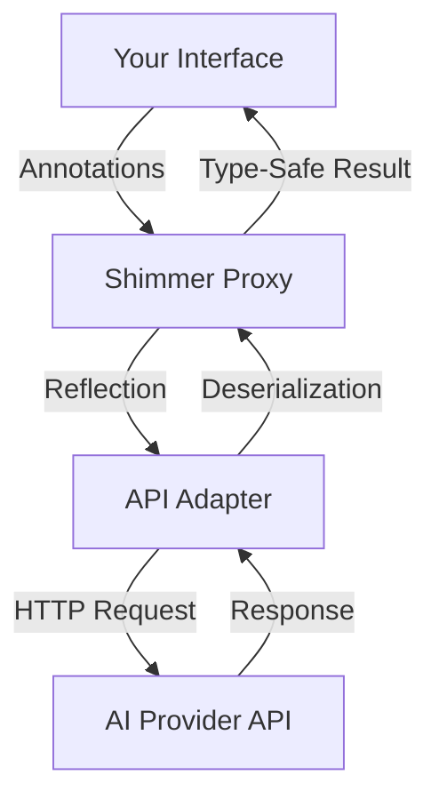

# ✨ AiApiShimmer ✨

<div align="center">


**_Bridging the gap between your code and AI, one annotation at a time_** 🌉

</div>

---

## 🚀 What is AiApiShimmer?

AiApiShimmer is a **magical bridge** between your Kotlin code and AI APIs. Just like how Retrofit transformed REST API interactions, AiApiShimmer revolutionizes how you communicate with AI services! 

No more wrestling with complex API calls, token management, or response parsing. Simply define an interface, sprinkle some annotations, and *voilà* – you have a fully functional AI-powered API client! ✨

```kotlin
// Define your interface
interface QuestionAPI {
    @AiOperation(description = "Provide an in-depth answer to the question")
    fun askQuestion(
        @AiParameter(description = "The question to be answered")
        question: String
    ): Future<String>
}

// Create an instance
val api = ShimmerBuilder(QuestionAPI::class)
    .setAdapterClass(OpenAiAdapter::class)
    .build().api

// Use it!
val answer = api.askQuestion("What is the meaning of life?").get()
```

---

## 📚 Table of Contents

- [✨ Features](#-features)
- [🔧 Installation](#-installation)
- [🏁 Quick Start Guide](#-quick-start-guide)
- [🧠 Conceptual Overview](#-conceptual-overview)
- [🎭 Use Cases](#-use-cases)
- [🧩 Advanced Usage](#-advanced-usage)
- [📋 API Reference](#-api-reference)
- [🔮 Future Roadmap](#-future-roadmap)

---

## ✨ Features

<div align="center">

| 🌟 Feature | 📝 Description |
|------------|----------------|
| **Interface-Driven Design** | Define your AI interactions through simple interfaces |
| **Annotation Magic** | Use annotations to provide rich context to the AI |
| **Multiple Adapters** | Support for different AI providers (OpenAI, and more to come!) |
| **Memory System** | Store and retrieve results from previous calls |
| **Agent Patterns** | Build complex AI workflows with simple or decision-making agents |
| **Type-Safe Responses** | Get strongly-typed responses from AI calls |
| **Asynchronous API** | All operations return Futures for non-blocking execution |

</div>

---

## 🔧 Installation

Add the dependency to your project:

<details open>
<summary><b>Gradle (Kotlin DSL)</b></summary>

```kotlin
dependencies {
    implementation("com.adamhammer:ai-api-shimmer:1.0.0")
}
```
</details>

<details>
<summary><b>Gradle (Groovy)</b></summary>

```groovy
dependencies {
    implementation 'com.adamhammer:ai-api-shimmer:1.0.0'
}
```
</details>

<details>
<summary><b>Maven</b></summary>

```xml
<dependency>
    <groupId>com.adamhammer</groupId>
    <artifactId>ai-api-shimmer</artifactId>
    <version>1.0.0</version>
</dependency>
```
</details>

---

## 🏁 Quick Start Guide

### Step 1: Define your API interface 🖋️

```kotlin
interface QuestionAPI {
    @AiOperation(
        summary = "Ask",
        description = "Provide an in-depth answer to the question within its context."
    )
    @AiResponse(
        description = "The answer to the question",
        responseClass = Answer::class
    )
    fun askStruct(
        @AiParameter(description = "The question and its context for the API call")
        question: Question?
    ): Future<Answer?>

    @AiOperation(
        summary = "AskString",
        description = "Provide an in-depth answer to the question within its context, returning a string response."
    )
    @AiResponse(
        description = "The answer as a string",
        responseClass = String::class
    )
    @Memorize("The last answer to the question.")
    fun askString(
        @AiParameter(description = "The question and its context for the API call")
        question: Question?
    ): Future<String?>
}
```

### Step 2: Define your data classes 📦

```kotlin
@Serializable
@AiSchema(title = "Question", description = "Holds info about the question")
class Question(
    @field:AiSchema(title = "Question", description = "The question to be asked")
    val question: String = "",
    @field:AiSchema(title = "Context", description = "Who is asking the Question")
    val context: String = ""
)

@Serializable
@AiSchema(title = "The Answer", description = "Holds the answer to the question.")
class Answer(
    @field:AiSchema(title = "Answer", description = "A resoundingly deep answer to the question")
    val answer: String = ""
)
```

### Step 3: Create an instance of your API 🔮

```kotlin
// Set your OpenAI API key as an environment variable
System.setProperty("OPENAI_API_KEY", "your-api-key")

// Create the API instance
val api = ShimmerBuilder(QuestionAPI::class)
    .setAdapterClass(OpenAiAdapter::class)
    .build().api

// Use the API
val question = Question("What is the meaning of life?", "A curious student")
val answer = api.askStruct(question).get()
println(answer?.answer)
```

### Step 4: Enjoy the magic! ✨

That's it! You now have a fully functional AI-powered API client. No more dealing with complex API calls, token management, or response parsing. Just define your interface, add some annotations, and you're good to go!

---

## 🧠 Conceptual Overview

### The AiApiShimmer Philosophy 💭

AiApiShimmer is built on a simple yet powerful idea: **_What if interacting with AI was as easy as defining an interface?_**

Traditional AI API interactions involve:
1. Constructing complex request objects
2. Managing API keys and tokens
3. Handling HTTP requests and responses
4. Parsing JSON responses
5. Error handling and retries

AiApiShimmer abstracts all of this away, letting you focus on what matters: **_what you want the AI to do_**.

### How It Works 🔍

<div align="center">



</div>

1. **Interface Definition**: You define an interface with methods representing AI operations
2. **Annotation Magic**: Annotations provide metadata about operations, parameters, and expected responses
3. **Dynamic Proxy**: AiApiShimmer creates a dynamic proxy implementing your interface
4. **Adapter Pattern**: The proxy delegates calls to an adapter for your chosen AI provider
5. **Type Safety**: Responses are deserialized into your specified types

### The Memory System 🧠

AiApiShimmer includes a built-in memory system that allows methods to store and retrieve results:

```kotlin
@Memorize("user-input")
fun storeInput(input: String): Future<String>

// The memory is passed to each request
fun retrieveWithContext(): Future<String> // Has access to the stored memory
```

This enables building stateful AI interactions where previous context matters!

---

## 🎭 Use Cases

### 💬 Conversational Agents

Create chatbots and conversational agents with ease:

```kotlin
interface ChatbotAPI {
    @Memorize("conversation-history")
    fun chat(userMessage: String): Future<String>
}

val chatbot = ShimmerBuilder(ChatbotAPI::class)
    .setAdapterClass(OpenAiAdapter::class)
    .build().api

// Each call has access to previous conversation history
println(chatbot.chat("Hello!").get())
println(chatbot.chat("What's the weather like?").get())
println(chatbot.chat("Can you remind me what we talked about?").get())
```

### 📝 Content Generation

Generate blog posts, product descriptions, or creative content:

```kotlin
interface ContentAPI {
    fun generateBlogPost(topic: String, keywords: List<String>): Future<BlogPost>
    fun generateProductDescription(product: Product): Future<String>
    fun createStory(prompt: String, genre: String): Future<Story>
}
```

### 🔍 Data Analysis

Analyze data and extract insights:

```kotlin
interface AnalysisAPI {
    fun summarizeText(text: String): Future<Summary>
    fun extractEntities(document: String): Future<List<Entity>>
    fun sentimentAnalysis(review: String): Future<Sentiment>
}
```

### 🤖 Autonomous Agents

Build complex autonomous agents that can make decisions:

```kotlin
val agentAdapter = ShimmerBuilder(AutonomousAIApi::class)
    .setAdapterClass(OpenAiAdapter::class)
    .build()

val deciderAdapter = ShimmerBuilder(DecidingAgentAPI::class)
    .setAdapterClass(OpenAiAdapter::class)
    .build()

val agent = AutonomousAgent(agentAdapter.api, deciderAdapter.api)

// The agent decides what to do next and executes it
val result = agent.step()
```

### 🎮 Game Development

Create NPCs with realistic dialogue and behavior:

```kotlin
interface GameNpcAPI {
    fun generateDialogue(character: Character, situation: String): Future<String>
    fun decideAction(character: Character, gameState: GameState): Future<Action>
}
```

---

## 🧩 Advanced Usage

### Working with Enums 🎲

AiApiShimmer handles enums gracefully:

```kotlin
@Serializable
enum class CardRank {
    UNDEFINED, TWO, THREE, FOUR, FIVE, SIX, SEVEN, EIGHT, NINE, TEN, JACK, QUEEN, KING, ACE
}

@Serializable
enum class CardSuit {
    UNDEFINED, HEARTS, DIAMONDS, CLUBS, SPADES
}

@Serializable
data class HigherCardResponse(
    val rank: CardRank = CardRank.UNDEFINED,
    val suit: CardSuit = CardSuit.UNDEFINED
)

interface HigherCardAPI {
    fun drawHigherCard(value: Int, suit: CardSuit): Future<HigherCardResponse>
}
```

### Building Agents 🤖

AiApiShimmer supports two types of agents:

#### Simple Agent with Fixed Steps

```kotlin
class SimpleAgent(private val api: SimpleAIApi) {
    fun ideate(input: String): IdeationResult {
        // Step 1: Generate initial ideas from the provided input
        api.initiate(input).get()

        // Step 2: Expand on the generated ideas
        api.expand().get()

        // Step 3: Generate the final markdown report
        val reportContent = api.report().get()
        val finalIdea = Idea(content = reportContent)
        return IdeationResult(idea = finalIdea)
    }
}
```

#### Decision-Making Agent

```kotlin
class AutonomousAgent(private val api: AutonomousAIApi, private val decider: DecidingAgentAPI) {
    fun step(): String {
        // Get the next action to take
        val decision = decider.decide(ShimmerInstance(api, mutableMapOf(), AutonomousAIApi::class)).get()
        
        // Execute the action based on the decision
        val result = when (decision.method) {
            "understand" -> {
                val data = decision.args["data"] ?: throw IllegalArgumentException("Missing 'data' argument")
                api.understand(data).get()
            }
            "analyze" -> api.analyze().get()
            "plan" -> api.plan().get()
            "reflect" -> api.reflect().get()
            "act" -> api.act().get()
            else -> throw IllegalArgumentException("Unknown method: ${decision.method}")
        }
        
        return result
    }
}
```

### Creating Custom Adapters 🔌

You can create your own adapters for different AI providers:

```kotlin
class MyCustomAdapter : ApiAdapter {
    override fun <R : Any> handleRequest(
        method: Method,
        args: Array<out Any>?,
        resultClass: KClass<R>,
        memory: Map<String, String>
    ): R {
        // Implement your custom adapter logic here
    }
}

// Use your custom adapter
val api = ShimmerBuilder(MyAPI::class)
    .setAdapterClass(MyCustomAdapter::class)
    .build().api
```

---

## 📋 API Reference

### Core Annotations 🏷️

| Annotation | Purpose | Target |
|------------|---------|--------|
| `@AiOperation` | Describes an API operation | Methods |
| `@AiParameter` | Describes a parameter | Parameters |
| `@AiResponse` | Describes the expected response | Methods |
| `@AiSchema` | Provides metadata for data structures | Classes, Fields |
| `@Memorize` | Indicates results that should be cached | Methods |
| `@Subscribe` | For pub/sub patterns | Methods, Fields, Parameters |
| `@Publish` | For pub/sub patterns | Methods, Fields, Parameters |

### ShimmerBuilder 🏗️

The main entry point for creating API instances:

```kotlin
val api = ShimmerBuilder(MyAPI::class)
    .setAdapterClass(OpenAiAdapter::class)
    .build().api
```

### Adapters 🔌

Available adapters:

- `OpenAiAdapter`: Sends requests to OpenAI's API
- `StubAdapter`: Simple implementation for testing

---

## 🔮 Future Roadmap

We're just getting started! Here's what's coming next:

- 🌐 **More Adapters**: Support for Anthropic, Google, and other AI providers
- 🔄 **Streaming Responses**: Support for streaming responses from AI providers
- 🔒 **Enhanced Security**: More options for API key management and security
- 📊 **Metrics and Monitoring**: Built-in support for tracking API usage and performance
- 🧪 **Testing Utilities**: More tools for testing AI-powered applications
- 📱 **Mobile Support**: Optimizations for Android and iOS

---

<div align="center">

## 💖 Join the AiApiShimmer Community!

[](https://github.com/adamhammer/ai-api-shimmer)
[](https://twitter.com/adamhammer)

**Made with ❤️ by [Adam Hammer](https://github.com/adamhammer)**

</div>

---

