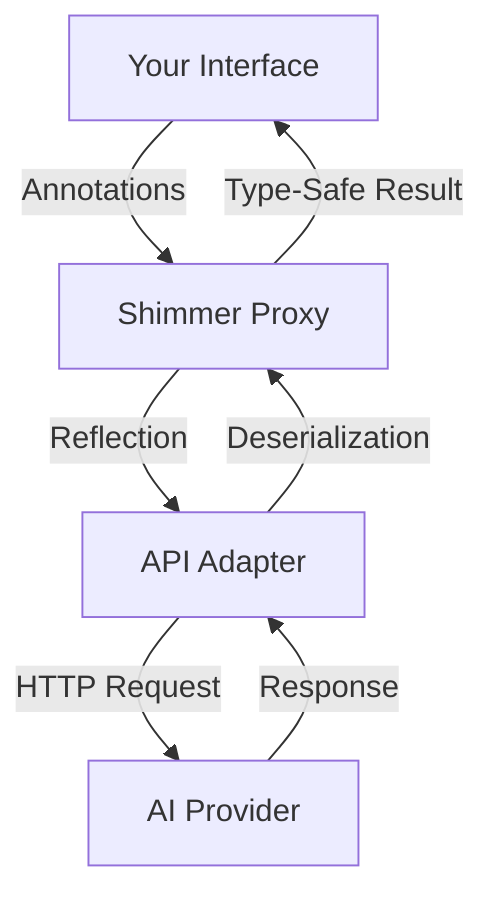

# AiApiShimmer


A **Retrofit-style interface abstraction for AI APIs** in Kotlin. Define an interface with annotations, and AiApiShimmer generates a type-safe client backed by a dynamic proxy — just like Retrofit does for REST.

```kotlin
interface QuestionAPI {
    @AiOperation(description = "Provide an in-depth answer to the question")
    fun askQuestion(
        @AiParameter(description = "The question to be answered")
        question: String
    ): Future<String>
}

val api = ShimmerBuilder(QuestionAPI::class)
    .setAdapterClass(OpenAiAdapter::class)
    .build().api

val answer = api.askQuestion("What is the meaning of life?").get()
```

## Features

- **Interface-driven** — define AI interactions as Kotlin interfaces
- **Annotation metadata** — describe operations, parameters, and response schemas for the AI
- **Adapter pattern** — swap AI providers without changing your interface (OpenAI included)
- **Memory system** — persist results across calls with `@Memorize` for stateful conversations
- **Type-safe responses** — get deserialized Kotlin objects back, not raw strings
- **Agent patterns** — build multi-step and decision-making AI workflows
- **Async by default** — all operations return `Future<T>`

## Installation

Clone and build from source:

```bash
git clone https://github.com/adamhammer/Shimmer.git
cd Shimmer
./gradlew build
```

Then add the module as a dependency in your project.

## Quick Start

### 1. Define your API interface

```kotlin
interface QuestionAPI {
    @AiOperation(
        summary = "Ask",
        description = "Provide an in-depth answer to the question within its context."
    )
    @AiResponse(
        description = "The answer to the question",
        responseClass = Answer::class
    )
    fun askStruct(
        @AiParameter(description = "The question and its context")
        question: Question?
    ): Future<Answer?>

    @AiOperation(
        summary = "AskString",
        description = "Answer the question, returning a plain string."
    )
    @Memorize("The last answer to the question.")
    fun askString(
        @AiParameter(description = "The question and its context")
        question: Question?
    ): Future<String?>
}
```

### 2. Define your data classes

```kotlin
@Serializable
@AiSchema(title = "Question", description = "Holds info about the question")
class Question(
    @field:AiSchema(title = "Question", description = "The question to be asked")
    val question: String = "",
    @field:AiSchema(title = "Context", description = "Who is asking the question")
    val context: String = ""
)

@Serializable
@AiSchema(title = "The Answer", description = "Holds the answer to the question.")
class Answer(
    @field:AiSchema(title = "Answer", description = "A deep answer to the question")
    val answer: String = ""
)
```

### 3. Build and use

```kotlin
// Requires OPENAI_API_KEY environment variable
val api = ShimmerBuilder(QuestionAPI::class)
    .setAdapterClass(OpenAiAdapter::class)
    .build().api

val question = Question("What is the meaning of life?", "A curious student")
val answer = api.askStruct(question).get()
println(answer?.answer)
```

## How It Works



1. You define an interface with methods representing AI operations
2. Annotations provide metadata about operations, parameters, and expected response schemas
3. `ShimmerBuilder` creates a JDK dynamic proxy implementing your interface
4. The proxy delegates calls to an `ApiAdapter` for your chosen AI provider
5. Responses are deserialized into your specified types via `kotlinx.serialization`

### Memory

Methods annotated with `@Memorize` store their results in a shared memory map, which is passed to subsequent requests. This enables multi-step workflows where context accumulates:

```kotlin
@Memorize("user-input")
fun storeInput(input: String): Future<String>

// Subsequent calls receive the stored memory automatically
fun retrieveWithContext(): Future<String>
```

## Advanced Usage

### Enums

AiApiShimmer handles enum types in request/response schemas:

```kotlin
@Serializable
enum class CardSuit { UNDEFINED, HEARTS, DIAMONDS, CLUBS, SPADES }

@Serializable
data class CardResponse(
    val rank: CardRank = CardRank.UNDEFINED,
    val suit: CardSuit = CardSuit.UNDEFINED
)

interface CardAPI {
    fun drawHigherCard(value: Int, suit: CardSuit): Future<CardResponse>
}
```

### Multi-Step Agents

Chain LLM calls in a fixed sequence using the memory system:

```kotlin
class SimpleAgent(private val api: SimpleAIApi) {
    fun ideate(input: String): IdeationResult {
        api.initiate(input).get()     // stored via @Memorize
        api.expand().get()            // reads previous memory, stores expanded result
        val report = api.report().get()
        return IdeationResult(idea = Idea(content = report))
    }
}
```

### Decision-Making Agents

Use `DecidingAgentAPI` to let the AI choose which method to call next:

```kotlin
val agent = AutonomousAgent(agentApi, deciderApi)
val result = agent.step() // AI decides and executes the next action
```

### Custom Adapters

Implement `ApiAdapter` to add support for other AI providers:

```kotlin
class MyAdapter : ApiAdapter {
    override fun <R : Any> handleRequest(
        method: Method,
        args: Array<out Any>?,
        resultClass: KClass<R>,
        memory: Map<String, String>
    ): R {
        // Your implementation
    }
}
```

## API Reference

### Annotations

| Annotation | Target | Purpose |
|------------|--------|---------|
| `@AiOperation` | Methods | Describes the AI operation (summary, description) |
| `@AiParameter` | Parameters | Describes a method parameter |
| `@AiResponse` | Methods | Specifies the expected response type and description |
| `@AiSchema` | Classes, Fields | Provides metadata for data structure schemas |
| `@Memorize` | Methods | Stores the method result in shared memory |
| `@Subscribe` | Methods, Fields, Parameters | Marks a subscription channel (pub/sub) |
| `@Publish` | Methods, Fields, Parameters | Marks a publication channel (pub/sub) |

### Built-in Adapters

| Adapter | Purpose |
|---------|---------|
| `OpenAiAdapter` | Sends requests to OpenAI (configurable model, defaults to GPT-4o-mini) |
| `StubAdapter` | Returns default-constructed instances for testing |

## License

MIT — see [LICENSE](LICENSE) for details.

