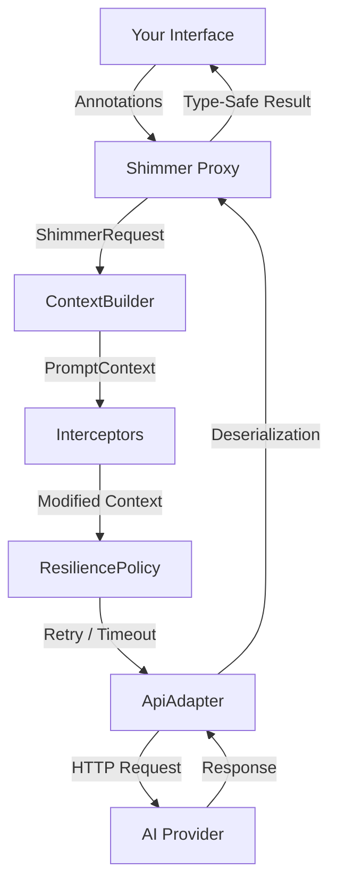

# Shimmer


A **Retrofit-style interface abstraction for AI APIs** in Kotlin. Define an interface with annotations, and Shimmer generates a type-safe client backed by a dynamic proxy — just like Retrofit does for REST.

```kotlin
interface QuestionAPI {
    @AiOperation(description = "Provide an in-depth answer to the question")
    fun askQuestion(
        @AiParameter(description = "The question to be answered")
        question: String
    ): Future<String>
}

val api = ShimmerBuilder(QuestionAPI::class)
    .setAdapterClass(OpenAiAdapter::class)
    .build().api

val answer = api.askQuestion("What is the meaning of life?").get()
```

## Features

- **Interface-driven** — define AI interactions as Kotlin interfaces
- **Annotation metadata** — describe operations, parameters, and response schemas for the AI
- **Adapter pattern** — swap AI providers without changing your interface (OpenAI included)
- **Context control** — replace or intercept the prompt pipeline with `ContextBuilder` and `Interceptor`
- **Resilience** — retry with exponential backoff, per-call timeouts, result validation, and fallback adapters
- **Memory system** — persist results across calls with `@Memorize` for stateful conversations
- **Type-safe responses** — get deserialized Kotlin objects back, not raw strings
- **Agent patterns** — build multi-step and decision-making AI workflows
- **Async by default** — all operations return `Future<T>`

## Project Structure

| Module | Description |
|--------|-------------|
| `shimmer-core` | Core library — annotations, proxy, context pipeline, resilience. Zero AI-provider dependencies. |
| `shimmer-openai` | OpenAI adapter — sends `PromptContext` to OpenAI and deserializes responses. |
| `samples-dnd` | Sample app — a text-based D&D adventure with the AI as Dungeon Master. |

## Installation

Clone and build from source:

```bash
git clone https://github.com/adamhammer/Shimmer.git
cd Shimmer
./gradlew build
```

Then add the modules as dependencies in your project:

```groovy
dependencies {
    implementation project(':shimmer-core')
    implementation project(':shimmer-openai')   // or your own adapter
}
```

## Quick Start

### 1. Define your API interface

```kotlin
interface QuestionAPI {
    @AiOperation(
        summary = "Ask",
        description = "Provide an in-depth answer to the question within its context."
    )
    @AiResponse(
        description = "The answer to the question",
        responseClass = Answer::class
    )
    fun askStruct(
        @AiParameter(description = "The question and its context")
        question: Question?
    ): Future<Answer?>

    @AiOperation(
        summary = "AskString",
        description = "Answer the question, returning a plain string."
    )
    @Memorize("The last answer to the question.")
    fun askString(
        @AiParameter(description = "The question and its context")
        question: Question?
    ): Future<String?>
}
```

### 2. Define your data classes

```kotlin
@Serializable
@AiSchema(title = "Question", description = "Holds info about the question")
class Question(
    @field:AiSchema(title = "Question", description = "The question to be asked")
    val question: String = "",
    @field:AiSchema(title = "Context", description = "Who is asking the question")
    val context: String = ""
)

@Serializable
@AiSchema(title = "The Answer", description = "Holds the answer to the question.")
class Answer(
    @field:AiSchema(title = "Answer", description = "A deep answer to the question")
    val answer: String = ""
)
```

### 3. Build and use

```kotlin
// Requires OPENAI_API_KEY environment variable
val api = ShimmerBuilder(QuestionAPI::class)
    .setAdapterClass(OpenAiAdapter::class)
    .build().api

val question = Question("What is the meaning of life?", "A curious student")
val answer = api.askStruct(question).get()
println(answer?.answer)
```

## Architecture



1. You define an interface with methods representing AI operations
2. Annotations provide metadata about operations, parameters, and expected response schemas
3. `ShimmerBuilder` creates a JDK dynamic proxy implementing your interface
4. The proxy builds a `ShimmerRequest` and passes it to a `ContextBuilder`
5. The `ContextBuilder` assembles a `PromptContext` (system instructions + method invocation JSON)
6. `Interceptor`s modify the context in registration order (inject world state, filter memory, etc.)
7. The `ResiliencePolicy` handles retries, timeouts, validation, and fallback
8. The `ApiAdapter` sends the final context to the AI provider
9. Responses are deserialized into your specified types via `kotlinx.serialization`

### Context Pipeline

The `ContextBuilder` and `Interceptor` interfaces give you full control over how prompts are constructed:

```kotlin
val api = ShimmerBuilder(MyAPI::class)
    .setAdapterClass(OpenAiAdapter::class)
    .setContextBuilder(myCustomContextBuilder)         // replace how prompts are built
    .addInterceptor { ctx ->                           // inject extra context
        ctx.copy(systemInstructions = ctx.systemInstructions + "\nBe concise.")
    }
    .addInterceptor(WorldStateInterceptor { world })   // inject game state
    .build().api
```

### Resilience

Configure retry, timeout, validation, and fallback behavior per `ShimmerBuilder`:

```kotlin
val api = ShimmerBuilder(MyAPI::class)
    .setAdapterDirect(primaryAdapter)
    .setResiliencePolicy(ResiliencePolicy(
        maxRetries = 3,                                 // retry up to 3 times on failure
        retryDelayMs = 1000,                            // initial delay between retries
        backoffMultiplier = 2.0,                        // exponential backoff
        timeoutMs = 30_000,                             // per-call timeout
        resultValidator = { result ->                   // reject invalid results
            (result as? MyResult)?.isValid == true
        },
        fallbackAdapter = StubAdapter()                 // use fallback after exhausting retries
    ))
    .build().api
```

### Memory

Methods annotated with `@Memorize` store their results in a shared memory map, which is passed to subsequent requests. This enables multi-step workflows where context accumulates:

```kotlin
@Memorize("user-input")
fun storeInput(input: String): Future<String>

// Subsequent calls receive the stored memory automatically
fun retrieveWithContext(): Future<String>
```

## Sample: Text D&D (`samples-dnd`)

A complete text-based D&D adventure demonstrating Shimmer's features:

- **World state tracking** — `WorldStateInterceptor` injects the full game world into every AI call
- **Result validation** — `ResiliencePolicy` rejects nonsensical HP changes
- **Memory** — the DM remembers previous scenes and actions via `@Memorize`
- **Structured responses** — `ActionResult` contains narrative, HP changes, inventory changes, location updates

Run the sample (requires `OPENAI_API_KEY`):

```bash
./gradlew :samples-dnd:run --console=plain
```

## Custom Adapters

Implement `ApiAdapter` to add support for other AI providers:

```kotlin
class MyAdapter : ApiAdapter {
    override fun <R : Any> handleRequest(
        context: PromptContext,
        resultClass: KClass<R>
    ): R {
        // context.systemInstructions — the system preamble
        // context.methodInvocation   — JSON method + params + schema
        // context.memory             — accumulated memory map
        // context.properties         — custom data from interceptors
    }
}
```

## API Reference

### Annotations

| Annotation | Target | Purpose |
|------------|--------|---------|
| `@AiOperation` | Methods | Describes the AI operation (summary, description) |
| `@AiParameter` | Parameters | Describes a method parameter |
| `@AiResponse` | Methods | Specifies the expected response type and description |
| `@AiSchema` | Classes, Fields | Provides metadata for data structure schemas |
| `@Memorize` | Methods | Stores the method result in shared memory |

### Core Interfaces

| Interface | Purpose |
|-----------|---------|
| `ApiAdapter` | Sends a `PromptContext` to an AI provider and returns a deserialized result |
| `ContextBuilder` | Builds a `PromptContext` from a `ShimmerRequest` — replace to control prompt assembly |
| `Interceptor` | Transforms a `PromptContext` before it reaches the adapter — runs in registration order |

### Built-in Adapters

| Adapter | Module | Purpose |
|---------|--------|---------|
| `OpenAiAdapter` | `shimmer-openai` | OpenAI API (configurable model, defaults to GPT-4o-mini) |
| `StubAdapter` | `shimmer-core` | Returns default-constructed instances for testing |

### Model Classes

| Class | Purpose |
|-------|---------|
| `PromptContext` | Assembled context for an AI call (system instructions, method invocation, memory, properties) |
| `ShimmerRequest` | Raw request data from a proxy method invocation |
| `ResiliencePolicy` | Configures retry, timeout, validation, and fallback behavior |

## License

MIT — see [LICENSE](LICENSE) for details.

