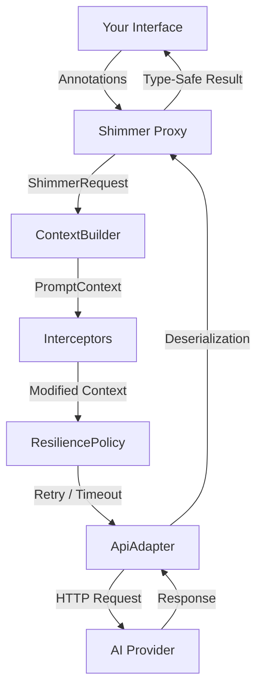

# Shimmer Core

The `shimmer-core` module provides the foundation for the Shimmer AI proxy library. It contains zero AI-provider dependencies and defines the core abstractions for building type-safe AI clients in Kotlin.

## Features

- **Interface-driven** — define AI interactions as Kotlin interfaces
- **Kotlin DSL** — configure with `shimmer<T> { ... }` builder DSL
- **Coroutine support** — `suspend` functions work natively alongside `Future<T>`
- **Streaming** — return `Flow<String>` for token-by-token streaming responses
- **Annotation metadata** — describe operations, parameters, and response schemas for the AI
- **Context control** — replace or intercept the prompt pipeline with `ContextBuilder` and `Interceptor`
- **Conversation history** — inject prior messages via `PromptContext.conversationHistory` for multi-turn conversations
- **Resilience** — retry with exponential backoff, per-call timeouts, result validation, and fallback adapters
- **Memory system** — persist results across calls with `@Memorize` for stateful conversations
- **Type-safe responses** — get deserialized Kotlin objects back, not raw strings
- **Multi-vendor routing** — route requests to different adapters per method

## Architecture



1. You define an interface with methods representing AI operations
2. Annotations provide metadata about operations, parameters, and expected response schemas
3. `shimmer<T> { ... }` (or `ShimmerBuilder`) creates a JDK dynamic proxy implementing your interface
4. The proxy builds a `ShimmerRequest` and passes it to a `ContextBuilder`
5. The `ContextBuilder` assembles a `PromptContext` (system instructions + method invocation JSON)
6. `Interceptor`s modify the context in registration order (inject world state, filter memory, etc.)
7. The `ResiliencePolicy` handles retries, timeouts, validation, and fallback
8. The `ApiAdapter` sends the final context to the AI provider
9. Responses are deserialized into your specified types via `kotlinx.serialization`

## Context Pipeline

The `ContextBuilder` and `Interceptor` interfaces give you full control over how prompts are constructed:

```kotlin
val instance = shimmer<MyAPI> {
    adapter(myAdapter)
    contextBuilder(myCustomContextBuilder)
    interceptor { ctx ->
        ctx.copy(systemInstructions = ctx.systemInstructions + "\nBe concise.")
    }
    interceptor { ctx ->
        ctx.copy(properties = ctx.properties + ("world" to worldState))
    }
}
```

## Resilience

Configure retry, timeout, validation, and fallback behavior:

```kotlin
val instance = shimmer<MyAPI> {
    adapter(primaryAdapter)
    resilience {
        maxRetries = 3
        retryDelayMs = 1000
        backoffMultiplier = 2.0
        timeoutMs = 30_000
        resultValidator = { result ->
            (result as? MyResult)?.isValid == true
        }
        fallbackAdapter = StubAdapter()
    }
}
```

## Memory

Methods annotated with `@Memorize` store their results (as JSON) in a shared memory map, which is passed to subsequent requests:

```kotlin
@Memorize("user-input")
fun storeInput(input: String): Future<String>

// Subsequent calls receive the stored memory automatically
fun retrieveWithContext(): Future<String>
```

Read memory state via `instance.memory` (read-only map).

## Multi-Vendor Routing

Use `RoutingAdapter` (or the lambda DSL overload) to route requests to different adapters based on the method name, properties, or any aspect of the `PromptContext`. This enables mixed-vendor solutions — for example, Anthropic for text completions and OpenAI for image generation:

```kotlin
val openAi = OpenAiAdapter(model = ChatModel.GPT_4O)
val anthropic = AnthropicAdapter()   // your custom adapter

val instance = shimmer<MyAPI> {
    // Lambda adapter — receives PromptContext, returns the adapter to use
    adapter { context ->
        when (context.methodName) {
            "generateImage" -> openAi
            else            -> anthropic
        }
    }
}
```

You can also route based on custom interceptor properties:

```kotlin
val instance = shimmer<MyAPI> {
    adapter { context ->
        val vendor = context.properties["vendor"] as? String
        when (vendor) {
            "openai"    -> openAiAdapter
            "anthropic" -> anthropicAdapter
            else        -> defaultAdapter
        }
    }
    interceptor { ctx ->
        // tag specific methods with a vendor
        val vendor = if (ctx.methodName.startsWith("generate")) "openai" else "anthropic"
        ctx.copy(properties = ctx.properties + ("vendor" to vendor))
    }
}
```

## Custom Adapters

Implement `ApiAdapter` to add support for other AI providers:

```kotlin
class MyAdapter : ApiAdapter {
    override suspend fun <R : Any> handleRequest(
        context: PromptContext,
        resultClass: KClass<R>
    ): R {
        // context.systemInstructions — the system preamble
        // context.methodInvocation   — JSON method + params + schema
        // context.methodName         — the proxy method name (useful for routing)
        // context.memory             — accumulated memory map
        // context.conversationHistory — prior messages for multi-turn
        // context.properties         — custom data from interceptors
        // context.availableTools     — tools from registered ToolProviders
    }

    // Override for token-by-token streaming
    override fun handleRequestStreaming(context: PromptContext): Flow<String> {
        // Return a Flow that emits tokens as they arrive
    }

    // Override for multi-turn tool calling
    override suspend fun <R : Any> handleRequest(
        context: PromptContext,
        resultClass: KClass<R>,
        toolProviders: List<ToolProvider>
    ): R {
        // Implement LLM ↔ tool loop:
        // 1. Send request with tool definitions
        // 2. If LLM requests tool calls, dispatch via toolProviders
        // 3. Feed results back, repeat until final response
    }
}
```