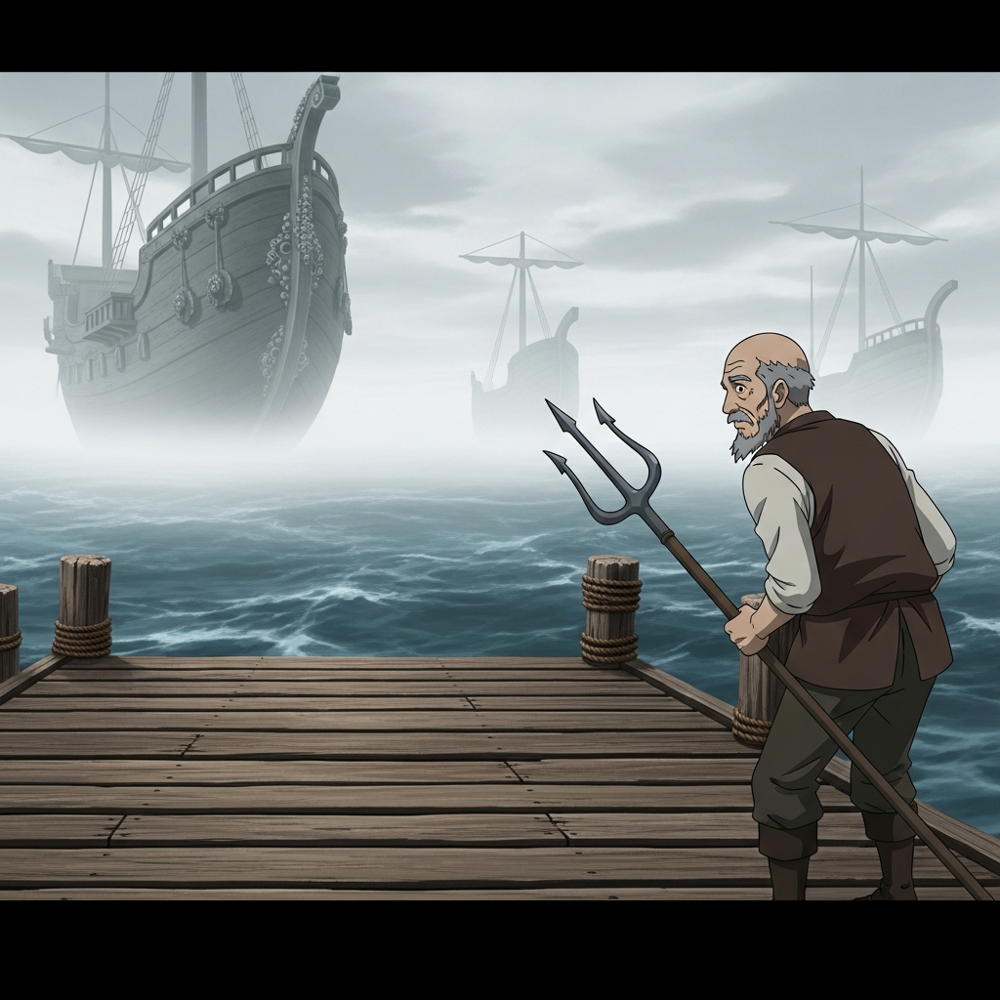
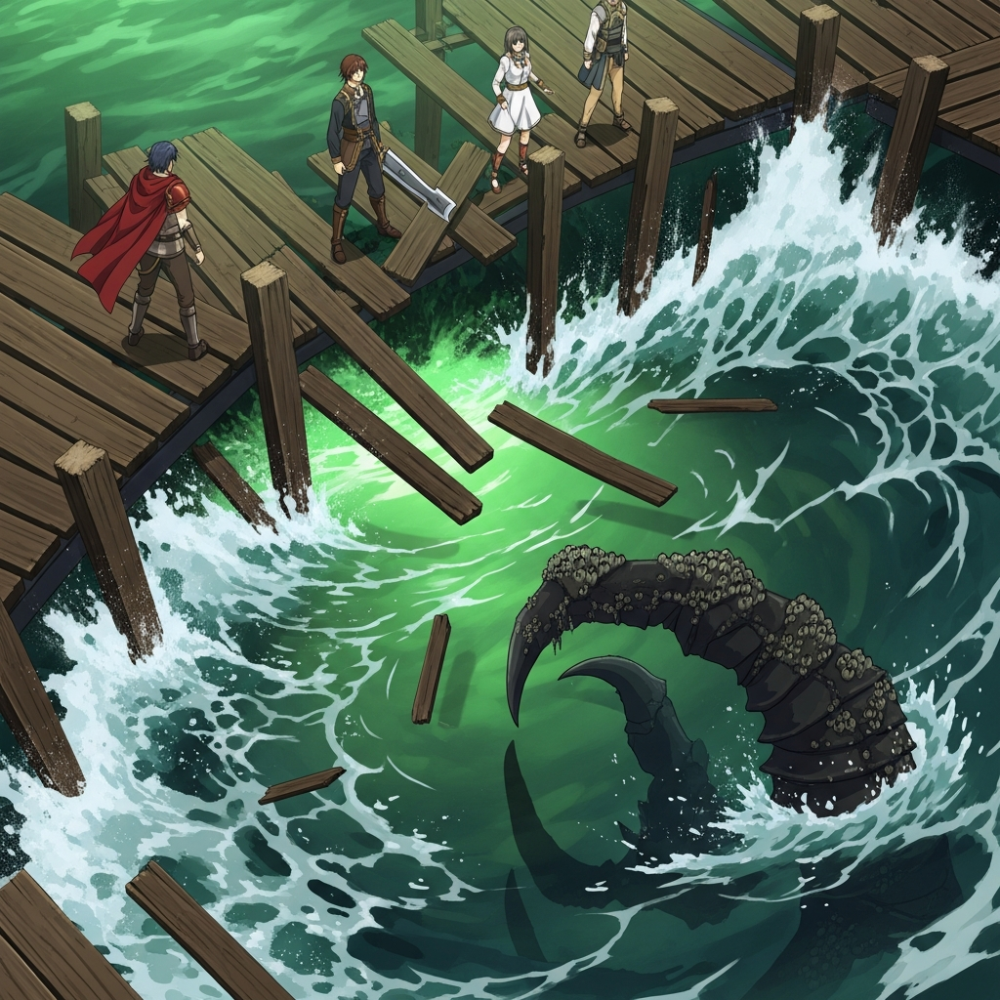
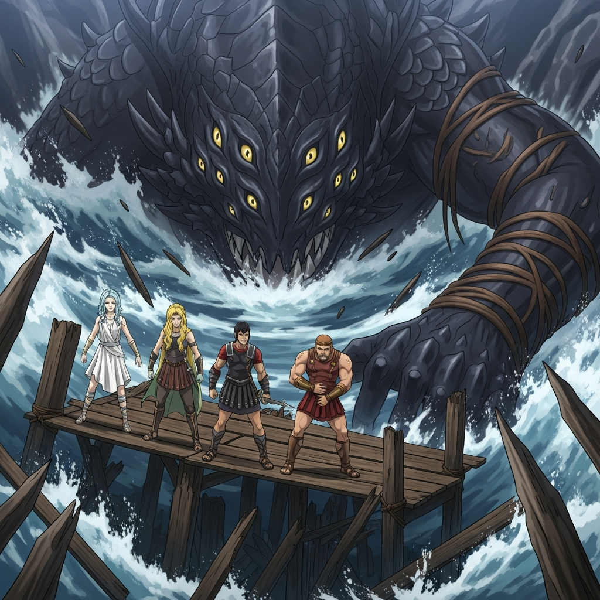
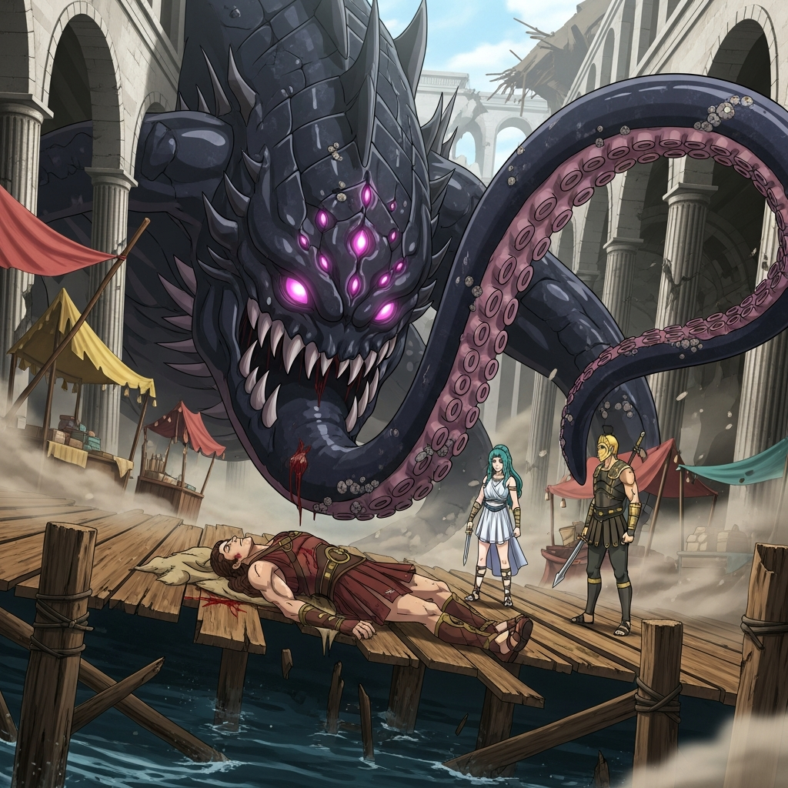
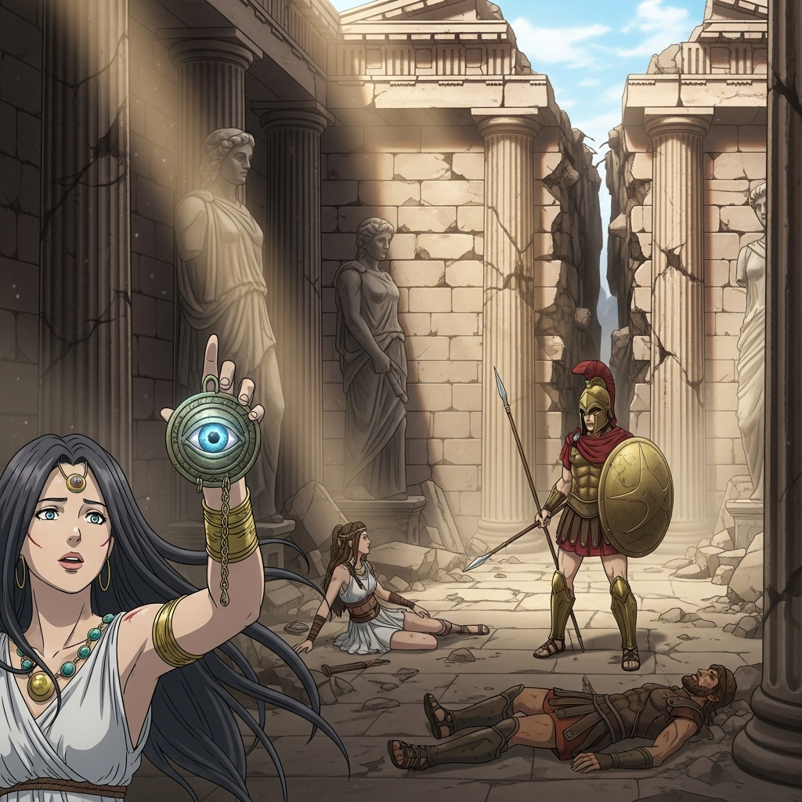
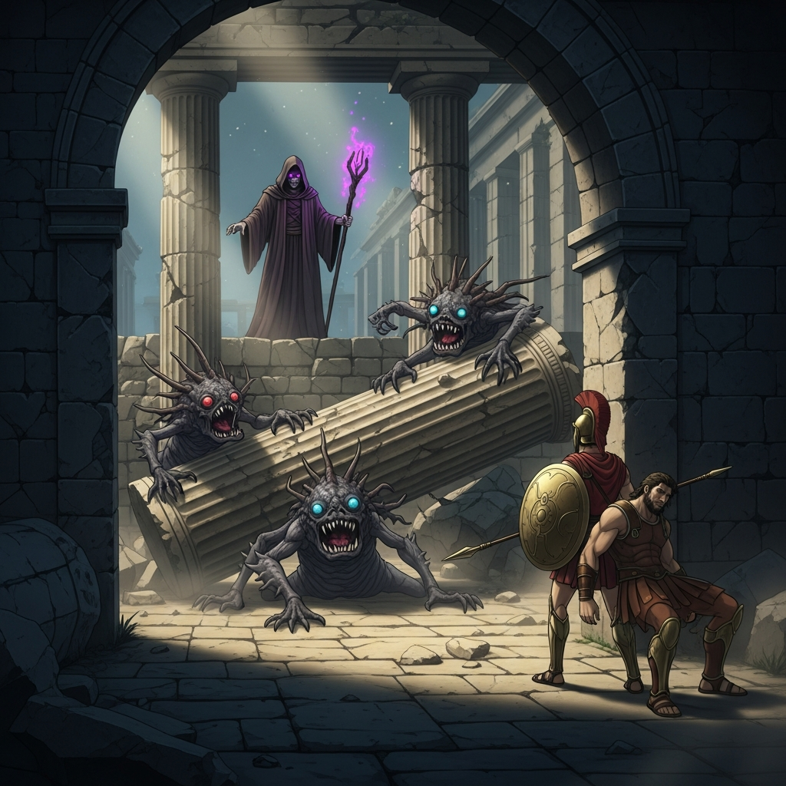
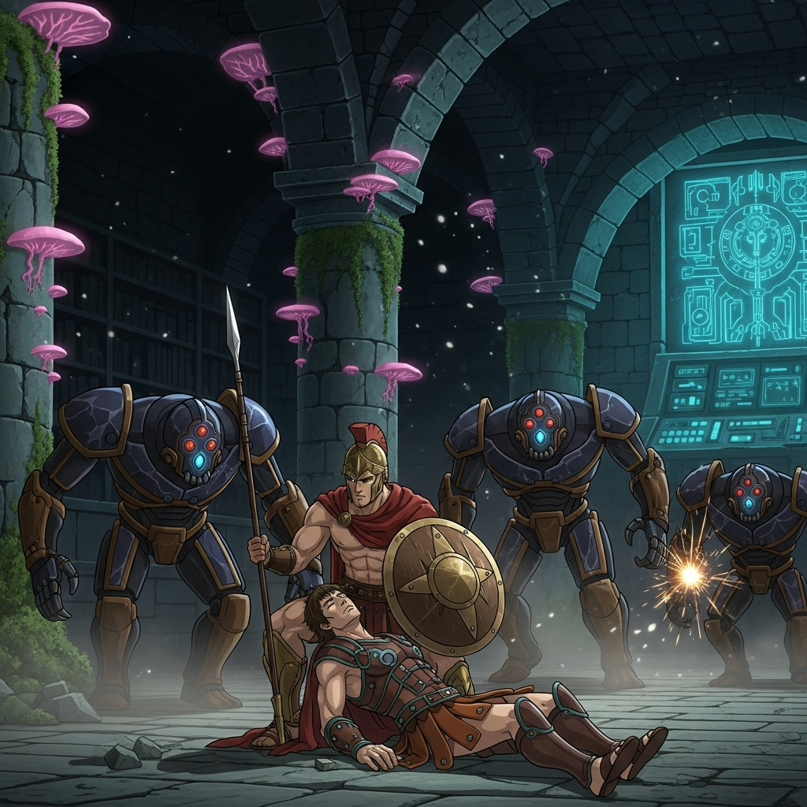
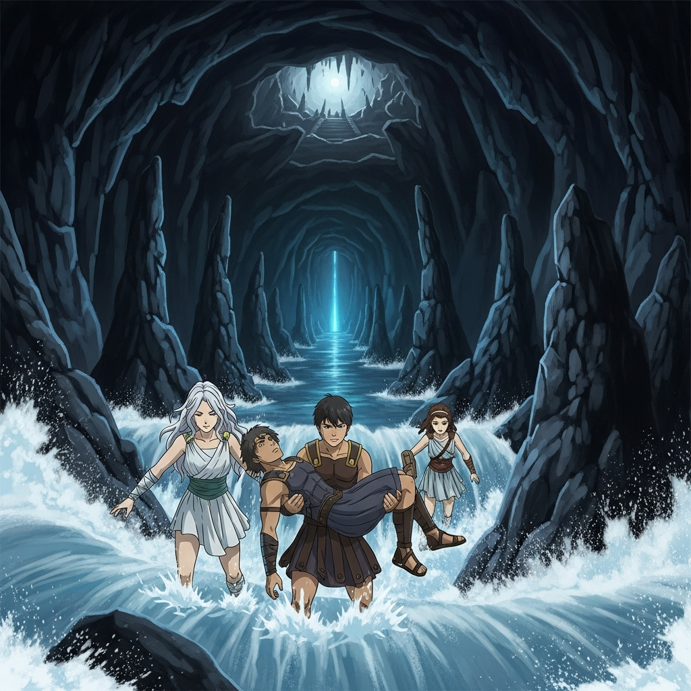

# D&D Campaign Timeline

*Generated: 2026-02-22 19:00:01*

## The Party

- **Medea** — Human Sorceress (Wizard) (Lvl 1) — 9/9 HP
- **Atalanta** — Human Huntress (Ranger) (Lvl 1) — DEAD
- **Achilles** — Demigod Hoplite (Fighter) (Lvl 1) — 4/9 HP
- **Heracles** — Demigod Champion (Barbarian) (Lvl 1) — DEAD

## World Building

- **buildCampaignPremise:** The gods of Olympus have fallen silent, and the Titans are breaking free from their prison in Tartarus. A band of demigods and mortal heroes must embark on an epic odyssey to gather the legendary weapons of the gods and prevent the destruction of the mortal world.
- **buildLocationGraph:** The air hangs heavy with the scent of salt and decay in Astrea, a port town once bustling with pious merchants and fishermen. Now, silence reigns, broken only by the mournful creak of unseen ropes and the distant, rhythmic lapping of waves against barnacle-encrusted hulls. You stand upon the weathered planks of the Silent Docks, where phantom ships seem to sway in the grey light, their masts like skeletal fingers pointing towards a sky devoid of divine favour. The usual clamor of a thriving port has been replaced by an eerie stillness, a stark testament to the gods' ominous silence.  To your east, the crumbling archway of what was once the vibrant Shattered Agora beckons, its marketplace stalls now overturned and empty. Northward, the Ancient Coastal Path winds its way along rugged cliffs, disappearing into a mist-shrouded distance. And to the west, the vast, inscrutable expanse of the Whisperwind Sea stretches out, a canvas of restless grey reflecting the somber mood of the world. The silence here is not peaceful; it is a profound emptiness, a vacuum waiting to be filled by something... or someone.
- **buildNpcRegistry:** NpcRegistryResult(npcs=[NpcProfile(name=Thalmus, role=Grizzled Fisherman / Harbinger of Doom, motivation=Survival and a desperate plea for understanding the gods' silence, perhaps seeking help for strange occurrences in the sea., currentLocation=Silent Docks, Astrea)])
- **buildPlotHooks:** *   **The Fisherman's Omen:** The grizzled fisherman, Thalmus, clutching a barnacle-encrusted trident, recounts tales of ancient leviathans stirring in the Whisperwind Sea, their cries echoing the gods' silence. He speaks of a peculiar, luminous kelp found far offshore, rumored to grow only where a god's tears have fallen, hinting at a lost relic or a direct sign from the heavens. He needs brave souls to investigate. *   **The Shattered Idol:** Within the desecrated Shattered Agora, amidst the overturned stalls, lies a colossal, broken idol of Poseidon. Scrawled across its base in an archaic script are words promising the rise of the Deep Titans and a prophecy of a sunken city holding a divine weapon, if only the waters could be calmed. *   **Whispers from the Abyss:** Strange, unsettling dreams plague the inhabitants of Astrea—visions of a great, cyclopean eye opening in the depths of Tartarus, sending ripples through the mortal realm. An old oracle in town, driven to madness, mutters about a "Celestial Anchor" lost in the depths, said to be the only thing holding back the true tide of Tartarus's fury.
- **commit:** World setup committed with 1 NPC(s) and 4 location node(s).

---

**ℹ️ Game Started:** 4 adventurers set out from Silent Docks, Astrea.

### 🎭 Opening Scene

The air hangs heavy with the scent of salt and decay in Astrea, a port town once bustling with pious merchants and fishermen. Now, silence reigns, broken only by the mournful creak of unseen ropes and the distant, rhythmic lapping of waves against barnacle-encrusted hulls. You stand upon the weathered planks of the Silent Docks, where phantom ships seem to sway in the grey light, their masts like skeletal fingers pointing towards a sky devoid of divine favour. The usual clamor of a thriving port has been replaced by an eerie stillness, a stark testament to the gods' ominous silence.

---

## Round 1 — Silent Docks, Astrea

🎲 **Medea** — Perception check (DC 15)

#### ❌ Medea

> **Action:** I look around cautiously.

As Medea meticulously scrutinizes her surroundings, a sudden, wet scuttling sound erupts from beneath a nearby barnacle-laden plank. Before she can fully react, a small, multi-legged creature, like a miniature, obsidian-shelled crab with unnaturally glowing eyes, darts out, snapping its pincers menacingly before vanishing back into the murky shadows below the dock.

🎲 **Atalanta** — Perception check (DC 15)

#### ✅ Atalanta

> **Action:** I look around cautiously.

Atalanta's sharp hunter's gaze sweeps over the docks. Unlike Medea, her focus is drawn not to the immediate shadows, but to the subtle disturbances in the water's surface near the weathered dock pylons. She discerns a faint, oily sheen, shimmering with a dim, unnatural glow that almost mirrors the unsettling light in the eyes of the creature Medea briefly saw. This suggests a larger, unseen presence lurking just beneath the murky depths, its essence seeping to the surface.

🎲 **Achilles** —  (DC 0)

#### ✅ Achilles

> **Action:** I look around cautiously.

Thalmus, observing Achilles' unyielding stance and focused gaze, slowly approaches, a glint of respect (or perhaps fear) in his eyes. He gestures towards the Whisperwind Sea. 'Aye, demigod. Your eyes see more than just the horizon. The deep is restless, but it only shows its true face to those who have faced the storm.'

🎲 **Heracles** —  (DC 0)

#### ✅ Heracles

> **Action:** I look around cautiously.

As Heracles' powerful form casts a long shadow over the water, the oily sheen Atalanta noticed suddenly pulses with a sickly green luminescence directly beneath the dock. A monstrous, shadowy outline briefly shifts below, revealing the unmistakable, jagged edge of an enormous, barnacle-encrusted claw that dwarfs even Heracles' hand. It quickly recedes, but the cold, unseen presence lingers, heavy and threatening, leaving a faint, acrid smell.

### 📜 Round 1 Summary

The entire Silent Docks groan under an immense, unseen pressure from below. Water explodes upwards between the planks, carrying jagged splinters of wood. The section of dock nearest to the Whisperwind Sea suddenly gives way with a sickening crack, collapsing into a whirlpool of churning foam and splintered timber. The ground beneath the party feels like it could rip apart at any moment.

---

## Round 2 — Silent Docks, Astrea

🎲 **Medea** — Intelligence (Arcana) check (DC 16)

#### ❌ Medea

> **Action:** I look around cautiously.

Medea channels her arcane senses, a faint glow emanating from her hands, probing the chaotic waters and splintered wood. Yet, the raw, primal force is too powerful to decipher through delicate arcane scrutiny; the sheer chaos of the collapsing dock and the unsettling energy from the depths overwhelm her, leaving her with a sense of dread rather than understanding.

🎲 **Atalanta** — Strength saving throw (DC 14)

#### ❌ Atalanta

> **Action:** I look around cautiously.

Suddenly, the churning water in the newly formed chasm pulls back with a chilling gasp, revealing for a fleeting second not just darkness, but a colossal, obsidian-scaled arm, thicker than an ancient oak, retracting into the abyssal gloom. A low, guttural rumble echoes from the deep, shaking the remaining dock to its foundations, and Atalanta feels an immense psychic pressure, a whisper of ancient, unbound rage, overwhelming her senses as the dark chasm seems to swallow the light around her. She stumbles back, momentarily disoriented by the sheer force of the unseen entity's presence. The dock continues to groan ominously, threatening further collapse. Heracles must act quickly to secure a safe path or risk the entire party falling into the abyss. Thalmus, wide-eyed, points frantically to the east. 'The Agora! There's an old, fortified section... it might hold!'

🎲 **Achilles** — Constitution saving throw (DC 14)

#### ✅ Achilles

> **Action:** I look around cautiously.

As the profound dread washes over him, Achilles, with his legendary resolve, steadies himself against the psychic assault. While the ground beneath his feet vibrates violently and the glimpse of primordial chaos is terrifying, he stands firm, his gaze unwavering despite the unseen horrors stirring below. He maintains his composure, witnessing the dock's relentless collapse and Atalanta's disorientation, understanding the dire urgency in Thalmus's frantic pointing towards the Shattered Agora.

🎲 **Heracles** — Dexterity saving throw (DC 14)

#### ❌ Heracles

> **Action:** I look around cautiously.

As Heracles attempts to evade the lashing claw, the unstable planks beneath him give way, and the monstrous, barnacle-encrusted limb slams into his side with crushing force. He grunts in pain as the impact throws him off balance, sending splinters flying. The remaining dock shudders violently, a chorus of groans echoing from beneath, making it clear that staying is no longer an option. The path to the Shattered Agora is the only hope.

### 📜 Round 2 Summary

As the last stable planks groan, a massive, obsidian-scaled arm, now fully visible, erupts from the chasm. It's connected to a leviathan of immense proportions, its multiple glowing eyes fixed on the party. Its guttural roar shakes the very air, and it lunges, effectively cutting off the direct path to the Shattered Agora. Escape requires either a desperate fight or finding a precarious route around its colossal form.

---

## Round 3 — Shattered Agora

🎲 **Medea** — Intelligence (Arcana) check (DC 15)

#### ✅ Medea

> **Action:** I look around cautiously.

Medea, channeling her arcane sight, penetrates the raw chaos surrounding the Leviathan. She doesn't just see scales and muscle; she perceives a faint, yet undeniable, echo of primordial magic within its obsidian form. This is no mere beast of the deep, but something infused with ancient, titanic energies. A faint, glowing symbol, reminiscent of a forgotten script, briefly flickers on a barnacle-encrusted plate near its gargantuan shoulder, hinting at a binding or a source of its immense power, subtly connected to the unsettling prophecy of the Deep Titans scrawled in the Shattered Agora. This knowledge could be crucial for finding a way to bypass or defeat it.

🎲 **Atalanta** — Dexterity (Acrobatics) check (DC 15)

#### ❌ Atalanta

> **Action:** I look around cautiously.

Atalanta, with her hunter's instinct, attempts to find purchase on the treacherous, rubble-strewn walls of the Shattered Agora, aiming to flank the colossal Leviathan. But as she reaches for a seemingly stable handhold, a section of ancient masonry crumbles to dust under her touch, sending a shower of sharp debris clattering into the churning waters below. The Leviathan, as if sensing her intent, lets out a guttural rumble that vibrates through the very stone, and its immense, scaled head shifts slightly, further obscuring any potential path. The precarious route she envisioned is now impassable, leaving the party no obvious way around the titanic beast, and its glowing eyes seem to fix on their exposed position, daring them to try again.

🎲 **Achilles** — Strength (Athletics) check (DC 15)

#### ❌ Achilles

> **Action:** I look around cautiously.

Achilles, with a determined roar, pushes against the immense, barnacled flank of the Leviathan, attempting to force a path through the precarious gap. But the beast's colossal mass is unyielding, like trying to move a mountain. As he strains, the ancient masonry of the Agora, already weakened by the Leviathan's presence, groans ominously above him. A shower of dust and small stones rains down as a crack spiderwebs across the archway he was using for leverage. The Leviathan, seemingly amused by his futile effort, merely shifts its glowing eyes, pinning him with an ancient, predatory gaze. The path is utterly blocked, and the very ground beneath him feels less stable than before, making any further attempt to force a way through suicidal.

🎲 **Heracles** — Dexterity saving throw (DC 15)

#### ❌ Heracles

> **Action:** I look around cautiously.

As Heracles attempts to evade the lashing tentacle, the unstable planks beneath him give way, and the monstrous, barnacle-encrusted limb slams into his side with crushing force. He grunts in pain, his already weakened body unable to withstand the blow, and collapses, unconscious and grievously wounded. The colossal Leviathan, its glowing eyes fixed on the remaining heroes, continues its relentless sweep, the tentacle now arcing towards Medea, Atalanta, and Achilles, threatening to drag them all into the churning chasm below!

### 📜 Round 3 Summary

With Heracles fallen and the Leviathan's tentacle sweeping, Atalanta's hunter instincts take over. She spots a precarious fissure in the crumbling Agora wall, a narrow, debris-choked path leading towards the Temple District. It demands a terrifying leap and a scramble over unstable rubble, but it's the only immediate alternative to being crushed by the beast.

---

## Round 4 — Shattered Agora

🎲 **Medea** — Intelligence (Arcana) check (DC 16)

#### ❌ Medea

> **Action:** I look around cautiously.

Medea, with a desperate surge of arcane energy, slams her palm against the crumbling Agora wall, whispering ancient words. But the magic, strained by the chaos and the raw power of the Leviathan, flickers erratically. Instead of solidifying, the masonry groans under her touch, shedding more dust and small stones. The attempt to create a magical foothold fails, leaving the already precarious fissure just out of reach, and the Leviathan's tentacle continues its menacing sweep. With Heracles unconscious and the path blocked, Atalanta must act quickly to find a way for the party to escape the monster's relentless assault before it's too late.

🎲 **Atalanta** — Dexterity (Acrobatics) check (DC 16)

#### ❌ Atalanta

> **Action:** I look around cautiously.

With a desperate surge, Atalanta springs towards the perilous fissure, her muscles coiling as she aims for a purchase on the crumbling wall. But the slick debris and precarious handholds betray her. Her fingertips scrape uselessly against the crumbling stone, and she loses balance. As she falls back, the Leviathan's colossal tentacle, moving with terrifying speed, whips through the air where she was moments before, narrowly missing her but impacting the already weakened archway above. A shower of massive stones and dust rains down, one striking Atalanta a glancing, painful blow that sends her sprawling near the edge of the chasm. The path to the fissure is now even more unstable, and the beast's glowing eyes fix on Achilles, the last standing hero, as its next target, its tentacle arcing to deliver a devastating blow!

🎲 **Achilles** — Attack roll (DC 15)

#### ✅ Achilles

> **Action:** I look around cautiously.

Achilles, meeting the Leviathan's impending strike, unleashes a ferocious counter-attack. His spear, honed by countless battles, finds purchase in a critical chink between the beast's colossal obsidian scales, near where Medea had observed the faint, flickering symbol. The Leviathan bellows in a sound of immense pain and surprise, recoiling violently. As it thrashes, a section of the already weakened Agora wall, directly adjacent to the precarious fissure Atalanta had struggled to reach, finally gives way with a groaning roar of crumbling stone. A new, desperate path into the relative safety of the Temple District is revealed, shrouded in dust but clear of the Leviathan's immediate reach. The passage is narrow and unstable, demanding immediate action, but for a precious few seconds, the way forward is open.

### 📜 Round 4 Summary

As Medea desperately searches for a stable surface to rest the unconscious Heracles, her fingers brush against a cold, slick stone. She glances down to see a section of the floor tiles, recently dislodged by the Leviathan's tremors, revealing a hidden compartment. Inside lies a tarnished bronze amulet, intricately carved with the symbol of a cyclopean eye, glowing with a faint, unsettling internal light. The air around it feels heavy, echoing with a faint, maddening whisper that only Medea, with her arcane senses, can perceive – a whisper of deep ocean pressure and forgotten power. This discovery feels directly linked to the disturbing dreams of Astrea and the "Celestial Anchor."

---

## Round 5 — Temple District

🎲 **Medea** — Wisdom (Perception) check (DC 14)

#### ❌ Medea

> **Action:** I look around cautiously.

Medea's efforts to carefully survey the crumbling Temple District are muddled by the lingering psychic echoes of the Leviathan and the oppressive air of decay. Her senses fail her just as a guttural hiss pierces the quiet. From the shadowed maw of a desecrated shrine, three gaunt, chitinous figures burst forth, their movements unsettlingly swift. Their eyes glow with a malevolent, bioluminescent light, and their grotesque forms radiate an aura of deep-sea corruption. Their gaze immediately locks onto the unconscious Heracles. Before anyone can fully react, the largest of the creatures lunges, aiming to seize the fallen hero and drag him back into the shrine's darkness! Achilles, witnessing the imminent threat, must act with lightning speed to intercept the monstrous attacker and protect his comrade.

🎲 **Atalanta** — Dexterity (Acrobatics) check (DC 14)

#### ✅ Atalanta

> **Action:** I look around cautiously.

With an almost impossible burst of agility, Atalanta launches herself towards the ancient, fractured pillar. Her hands find purchase on crumbling stone, and with a superhuman heave, she wrenches it from its precarious perch. The massive column crashes down with a deafening roar, showering dust and debris, just as the largest chitinous creature reaches Heracles. The pillar lands squarely between the creature and the unconscious hero, forcing the monstrosity to recoil with a pained hiss as smaller fragments strike its carapace. For a moment, the corrupted creatures are momentarily stunned and separated from their target, buying precious seconds.

🎲 **Achilles** — Strength (Athletics) check (DC 14)

#### ✅ Achilles

> **Action:** I look around cautiously.

Achilles, seizing the momentary reprieve created by Atalanta's swift action, hooks an arm under Heracles' unconscious form. With a powerful grunt, he hauls the fallen hero deeper into the shadowed recesses of a crumbling archway, away from the chitinous figures. The dust and debris from the toppled pillar provide a temporary screen, and for a precious few moments, Heracles is out of their immediate, grasping reach, shielded by Achilles' unwavering determination.

### 📜 Round 5 Summary

Just as the corrupted creatures regain their footing, a new, unsettling sound pierces the air – a low, resonant chant that vibrates from the very stones of the Temple District. From the deepest shadows of a collapsing archway, a robed figure emerges, its face obscured by a hood, but its staff glows with a sickly, purple light. The corrupted creatures pause, their bioluminescent eyes turning towards the newcomer, chittering in what might be recognition or subservience. The figure raises a hand, and the creatures fall silent, their attention now divided between the party and this mysterious, unnerving presence. A faint, cloying scent of ozone and something ancient hangs heavy in the air.

---

## Round 6 — Temple District

🎲 **Medea** — Dexterity saving throw (DC 14)

#### ✅ Medea

> **Action:** I look around cautiously.

Medea, reacting with lightning-fast reflexes, twists and contorts her body with an almost supernatural grace. The corrupted tendrils of shadow, crackling with dark energy, lash out and whip past her, narrowly missing their target as she spins away from the cultist's direct assault. Her arcane senses confirm it: the robed figure's eyes, though hidden, burn with a predatory focus, clearly recognizing her magical prowess. The Shadowed Cultist lets out a frustrated hiss, and the three chitinous creatures, spurred on by their master, now advance with renewed ferocity towards Achilles and the unconscious Heracles, their bioluminescent eyes glowing with hunger. The confrontation has begun in earnest, and the cultist raises their staff, preparing to unleash another dark spell.

🎲 **Atalanta** — Dexterity (Acrobatics) check (DC 14)

#### ❌ Atalanta

> **Action:** I look around cautiously.

Atalanta, with a desperate surge of agility, tries to vault over a crumbling pew to position herself between the advancing chitinous creatures and Achilles. However, the ancient stone, slick with unknown grime, crumbles under her boot. Her foot slips, and she stumbles, momentarily losing her footing. The precious seconds she loses are enough for the largest of the grotesque figures to dart past her, its multi-jointed legs scuttling ominously. It now stands dangerously close to Achilles and the unconscious Heracles, its glowing eyes fixed on the fallen hero, while the cultist's staff hums with dark energy, readying a potent strike. Achilles, now directly confronted by the creature, must prepare to defend himself and Heracles from its immediate assault.

🎲 **Achilles** — Attack roll (DC 14)

#### ❌ Achilles

> **Action:** I look around cautiously.

Achilles, with a frustrated roar, drives his spear forward, but the chitinous creature twists with unsettling speed. His weapon scrapes harmlessly across its incredibly tough carapace, failing to find any purchase. Seizing Achilles' momentary imbalance, the largest grotesque figure lunges, its barbed claw raking across Heracles' already unconscious form. A sickening tearing sound echoes, and the fallen hero's body slumps further, bleeding anew. Simultaneously, the Shadowed Cultist's staff flares with renewed malevolence, a volley of dark, crackling energy bolts erupting towards Achilles, aiming to drive him away from Heracles and allow the creatures to seize their prize.

### 📜 Round 6 Summary

Atalanta, agile as a deer, shakes off her stumble. Instead of a direct confrontation, she uses the chaotic environment to her advantage, darting towards a series of broken altars and crumbling statues, attempting to lure one of the chitinous creatures away from Heracles and create a more favorable tactical position for herself and Achilles.

---

## Round 7 — Temple District

🎲 **Medea** — Spell Attack (DC 13)

#### ✅ Medea

> **Action:** I look around cautiously.

Medea, witnessing the cultist's dark magic lash out and Heracles's body slump from a fresh wound, unleashes her arcane fury. A searing bolt of pure, crackling energy erupts from her hands, arcing through the dim temple air with terrifying speed. It strikes the Shadowed Cultist squarely in the chest, tearing through their shadowed robes. The cultist stumbles backward with a guttural cry, their staff momentarily dimming as the dark energy bolts assailing Achilles dissipate into harmless smoke. The connection to the chitinous creatures seems to waver for a split second, their bioluminescent eyes flickering with confusion, but their hunger for Heracles remains undimmed. Medea's potent strike has bought Achilles a crucial reprieve, but the creatures are still a formidable threat, and the cultist is merely staggered, not defeated.

🎲 **Atalanta** — Dexterity (Acrobatics) check (DC 15)

#### ✅ Atalanta

> **Action:** I look around cautiously.

With a deftness born of countless hunts through treacherous terrain, Atalanta's gaze locks onto the hidden crevice behind the colossal fallen altar. Her successful leap is a blur of motion, her hands finding purchase on crumbling stones, and with a powerful heave, she widens the narrow opening just enough. She turns, urgency etched on her face, and gestures wildly to Achilles, urging him to bring the unconscious Heracles and follow. The desperate escape through the newly revealed passage is successful, as the sounds of the Temple District's battle and the menacing chittering of the corrupted creatures begin to fade behind them, replaced by the damp quiet of the deep.

🎲 **Achilles** — Dexterity (Acrobatics) check (DC 14)

#### ❌ Achilles

> **Action:** I look around cautiously.

Achilles, with the inert weight of Heracles in his arms, lunges for the passage Atalanta widened. But the slick, crumbling rock proves too treacherous. His foot slips on a loose stone, and the combined weight sends him stumbling. He slams against the narrow walls, a sharp pain radiating from his side as he struggles to keep Heracles from hitting the jagged edges. He manages to recover, a pained grunt escaping his lips, but not without further jostling Heracles and taking a hard knock himself. They tumble through the last stretch of the passage, landing ungracefully in the damp, quiet darkness of the Sunken Archives, now truly out of the Temple District, but bruised and shaken by the desperate scramble.

### 📜 Round 7 Summary

As the damp silence settles, a deep, rhythmic thrum vibrates through the stone floor. From behind crumbling sarcophagi, three hulking automatons, crafted from obsidian and bronze, creak to life. Their multi-faceted eyes glow with a cold, internal light as they slowly pivot towards the party, their heavy steps echoing through the passages. These ancient guardians, silent for millennia, awaken with a singular, programmed purpose: to eliminate intruders. They lumber menacingly towards Achilles and the unconscious Heracles, metallic claws extending.

---

## Round 8 — Sunken Archives

🎲 **Medea** — Spell Attack (DC 13)

#### ❌ Medea

> **Action:** I look around cautiously.

Medea's incantation rings through the damp air, and a bolt of raw earth magic surges forth. However, her aim is off, or perhaps the automaton's ancient defenses are stronger than anticipated. The bolt harmlessly splashes against the obsidian plating of the lead automaton, doing nothing but drawing its cold, metallic gaze even more intently towards her. Its multi-faceted eyes glow with hostile intent, and it continues its menacing advance, undeterred.

🎲 **Atalanta** — Attack roll (DC 14)

#### ✅ Atalanta

> **Action:** I look around cautiously.

Atalanta's keen hunter's eyes, despite her cautious demeanor, pierce through the dim light of the archives. She nocks an arrow swiftly, her gaze locked on a faint, shimmering glyph on the lead automaton's shoulder. With a soft twang, the arrow finds its mark. A crackle of arcane energy erupts from the glyph, and the obsidian-and-bronze automaton shudders violently, its heavy movements becoming erratic. Sparks fly from its joints, and its multi-faceted eyes flicker dimly, momentarily losing focus as the ancient magic within it struggles to maintain cohesion. The automaton's advance falters, giving the party a crucial reprieve.

🎲 **Achilles** — Intelligence (Investigation) check (DC 15)

#### ✅ Achilles

> **Action:** I look around cautiously.

Achilles, still burdened by Heracles' unconscious form, nonetheless casts his keen gaze across the ancient stonework. His sharp senses pierce through the dust and shadow, revealing not just superficial details, but a profound, rhythmic thrumming emanating from a previously unseen section of the wall. There, a complex array of glowing glyphs flickers, mirroring the lumbering movements of the automatons. This is no mere decoration, but a central control panel, pulsing with dormant magic – a direct means to perhaps halt these stone guardians or unleash another ancient defense. The automatons, though damaged, continue their relentless advance towards him and the fallen Heracles.

### 📜 Round 8 Summary

Achilles, still burdened by Heracles' unconscious form, shoves the fallen hero into a recessed alcove, his eyes fixed on the flickering control panel. The automatons, though one falters, continue their relentless advance, closing the distance. He knows he must decipher the ancient glyphs before they are overwhelmed. As his hand brushes the cold stone, the panel hums with an unknown, potent energy.

---

## Round 9 — Sunken Archives

🎲 **Medea** — Intelligence (Arcana) check (DC 16)

#### ❌ Medea

> **Action:** I look around cautiously.

Medea's quick, intense study of the flickering glyphs on the control panel yields only frustration. The ancient runic language twists and warps beneath her mental grasp, its meaning eluding her. A surge of arcane energy, far from a controlled deactivation, backlashes from the panel, causing the nearest automaton to roar to life with renewed, terrifying vigor. Its multi-faceted eyes glow brighter, and it lurches forward with alarming speed towards Achilles, who remains burdened by the unconscious Heracles. The automatons are closing in, and Medea's attempt to decipher the controls has only served to enrage them further, leaving the party exposed and vulnerable.

🎲 **Atalanta** — Attack roll (DC 14)

#### ❌ Atalanta

> **Action:** I look around cautiously.

Atalanta, seeing the precarious ceiling above, swiftly aims her bow at a weakened support beam. Her arrow flies true, striking the ancient stone with a sharp thud, but the crack, though visible, is not enough. The beam shudders but holds, the tons of rubble above remaining stubbornly in place. The automatons, seemingly invigorated by Medea's failed arcane interference, continue their relentless, thundering advance towards Achilles and the unconscious Heracles, their metallic claws reaching. The path to escape this area is narrowing with every passing second.

🎲 **Achilles** — Strength (Athletics) check (DC 15)

#### ✅ Achilles

> **Action:** I look around cautiously.

As Medea's magic backfires and Atalanta's arrow fails to collapse the ceiling, the automatons surge forward, their metallic claws glinting menacingly. Suddenly, a colossal tremor rips through the Sunken Archives, far more profound than any before. The very foundations groan, and the passage leading back towards the Temple District begins to buckle and collapse with a deafening roar, showering debris. With a grunt of powerful effort, Achilles, still burdened by Heracles, reacts with demigod speed. He spots a narrow, dark opening in the crumbling floor, barely discernible through the dust and rockfall, leading into the abyssal depths below. Leveraging his immense strength, he shoves a dislodged pillar, creating just enough space, and then, with incredible agility, he lowers himself and the unconscious Heracles into the newfound passage, just as the rest of the archives give way behind them. The roar of the collapse seals their former path, but Achilles' decisive action has plunged them into the Subterranean Waterways.

### 📜 Round 9 Summary

Amidst the roar of the water, a faint, rhythmic pulse of ethereal blue light catches your eye from deeper within the Treacherous Ledge passage. It feels ancient, powerful, and strangely familiar, echoing the unsettling dreams of the cyclopean eye.

---

## Round 10 — Subterranean Waterways

🎲 **Medea** — Intelligence (Arcana) check (DC 15)

#### ❌ Medea

> **Action:** I look around cautiously.

Medea's cautious gaze, infused with her inherent magical perception, cuts through the damp gloom of the Subterranean Waterways. The ethereal blue light emanating from the Treacherous Ledge passage vibrates with arcane energy, undeniably linked to the whispers of the 'Celestial Anchor' and the cyclopean eye. However, despite her intense focus, the ancient, complex sigils resist her full understanding. The path forward remains obscured, a crucial detail just beyond her grasp, leaving the means to interact with this potent magic a dangerous enigma.

🎲 **Atalanta** — Dexterity saving throw (DC 16)

#### ❌ Atalanta

> **Action:** I look around cautiously.

Atalanta attempts to leap onto the precarious, algae-covered trail leading deeper into the Treacherous Ledge, but a sudden, powerful geyser of water erupts from the main current. She is buffeted violently, losing her footing and tumbling into the rushing currents. Though she struggles against the powerful undertow, she manages to grasp a jagged rock formation, pulling herself battered and bruised onto the treacherous ledge. The path is clear, but the force of the waters has taken its toll, leaving her gasping.

🎲 **Achilles** — Wisdom saving throw (DC 15)

#### ❌ Achilles

> **Action:** I look around cautiously.

Achilles' attempt at cautious observation is overwhelmed as the pulsating blue light floods his senses, not just visually, but intellectually. The light isn't merely a physical phenomenon; it is a direct mental projection from the Celestial Anchor itself, conveying an ancient, crushing weight of cosmic responsibility. He feels the immense pressure of holding back the Titans, the sheer strain on the silent gods. However, the sheer magnitude of the burden is too great; the full truth, the precise mechanism to 'steer its fate,' eludes his grasp. He is left with a profound sense of the Anchor's raw, desperate power and the impending doom it barely holds back, but no clear path to resolution.

### 📜 Round 10 Summary

The celestial anchor pulses intensely, radiating a powerful, undeniable draw. Achilles, already bearing the mental burden of its power, feels a profound, almost primal urge to merge with its essence, to become the fulcrum of its cosmic balance. But the Anchor's power is a double-edged sword; it simultaneously siphons the life force from the incapacitated Atalanta and Heracles, their forms flickering like dying embers. A sacrifice must be made – either Achilles embraces his demigod destiny and becomes one with the Anchor, or Medea must somehow sever its connection to the fallen, though at immense personal cost.

---

## Final Status

- **Round:** 10/10
- **Location:** Subterranean Waterways
- **Quests:** Investigate the strange occurrences in the Whisperwind Sea, as recounted by Thalmus.; Explore the Shattered Agora to uncover the prophecy of a sunken city and a divine weapon.; Seek out the old oracle in Astrea regarding the 'Celestial Anchor' and visions of Tartarus.; The Silent Docks are collapsing. Seek immediate refuge in the Shattered Agora to the East.; The Silent Docks are collapsing. Seek immediate refuge in the Shattered Agora to the East.; The Silent Docks are collapsing. Reach the Shattered Agora immediately.; The Leviathan blocks passage to the Shattered Agora. Find a way to bypass or defeat it.; Navigate the precarious fissure in the Agora wall to escape the Leviathan's attack.; Escape the Leviathan's attack by using magic to forge a path through the crumbling Agora to the fissure.; Defend against the Leviathan's attack and find a way to escape.; Escape to the Temple District through the newly opened fissure.; Investigate the mysterious amulet with the cyclopean eye and its connection to the 'Celestial Anchor'.; Defend Heracles from the corrupted creatures.; Utilize the environment to defend against the corrupted creatures.; Keep Heracles safe from the corrupted creatures.; Investigate the mysterious robed figure and its connection to the corrupted creatures.; Prevent the Shadowed Cultist from capturing Heracles.; Defeat the Shadowed Cultist and the corrupted creatures.; Escape the Temple District and the Shadowed Cultist through the newly discovered passage. Explore the Sunken Archives.; Defeat the ancient automatons guarding the Sunken Archives.; Discover how to operate or deactivate the ancient automaton control panel.; Activate or deactivate the ancient automaton control panel.; Find another way to escape the Sunken Archives, as the control panel is unresponsive.; Escape the collapsing Sunken Archives and navigate the Subterranean Waterways.; Investigate the mysterious pulsing light in the Subterranean Waterways.; Follow the pulsating blue light to the Celestial Anchor.; Make the ultimate sacrifice or find a new path to secure the Celestial Anchor and prevent the Titans' full release.

- **Medea** (❤️ 9/9) — healthy
- **Atalanta** (☠️ DEAD) — healthy
- **Achilles** (❤️ 4/9) — healthy
- **Heracles** (☠️ DEAD) — Unconscious

